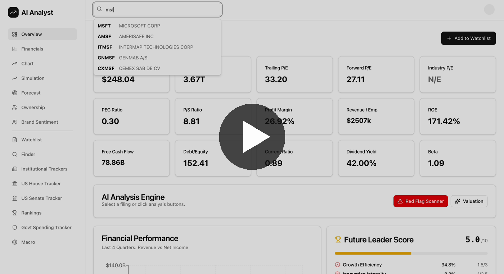
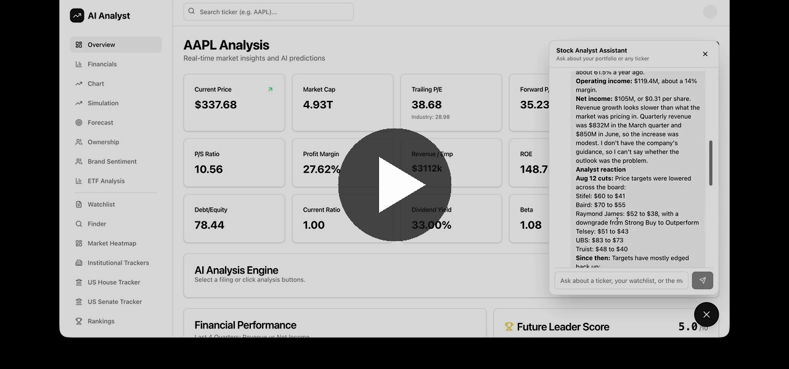

# AI Analyst

AI-powered stock and ETF research dashboard.

## Demo

**Full walkthrough**

[](https://youtu.be/b412Drb1zYM)

*Click the image to watch the 7-minute walkthrough on YouTube. To open it in a new tab, Ctrl-click it (Windows/Linux) or ⌘-click it (Mac).*

**Stock Analyst Assistant (chat agent)**

[](https://youtu.be/rlcHrS3WdBg)

*Click the image to watch the chat assistant research a ticker and answer questions, live, on YouTube.*

## About

AI Analyst puts fundamental data, market data and AI-written analysis for a stock or ETF on one dashboard. Search for a ticker to see its key metrics, quarterly financial statements, price charts with technical indicators, analyst forecasts and ownership. You can also run a Monte Carlo DCF valuation, or have Google Gemini summarize SEC filings, flag valuation and risk red flags, and read price charts and macro conditions. A **Stock Analyst Assistant** — a chat bubble in the bottom-right corner of every page (Claude, with real tool access to this app's data) — answers open-ended questions, showing its work as it looks things up. It can suggest watchlist additions, but only ever adds one with your explicit confirmation.

Beyond single stocks, the app tracks the wider market:

- **Market views:** an S&P 500 relative-strength heatmap, sector performance, and a macro dashboard of indices, rates, currencies and commodities.
- **Future Leader rankings:** small-, mid- and large-cap companies scored on growth efficiency, R&D intensity, scalability, valuation and ROIC.
- **Smart-money trackers:** US House and Senate stock trades, Vanguard and Munro Partners 13F moves, and book-to-bill ratios for government contractors.
- **Brand sentiment:** sentiment scored from news and YouTube reviews.
- **ETF analysis:** holdings, sector allocation, and an AI "Quality Core" assessment.

**Built with:** Next.js, React, TypeScript, Tailwind CSS and shadcn/ui on the frontend; Python FastAPI on the backend. Data comes from Yahoo Finance, SEC EDGAR, USAspending.gov and Financial Modeling Prep. Google Gemini writes the AI analysis, MongoDB stores precomputed data, and the app is deployed on Vercel.

Every pull request also gets an automated, advisory-only code review from Claude Code (`.github/workflows/claude-code-review.yml`); see the "Code review checklist" it follows in [CLAUDE.md](CLAUDE.md).

See [docs/ARCHITECTURE.md](docs/ARCHITECTURE.md) for how it's built and [CLAUDE.md](CLAUDE.md) for development conventions.

---

## Run your own copy

This repository is a personal project and **does not accept contributions**. Only the owner can push to it, and pull requests won't be merged. To use or change the app, **fork it** and work in your fork. Your fork is your own copy: you can change anything there and deploy it under your own accounts.

Setup has five steps:

1. [Fork and clone the repo](#1-fork-and-clone-the-repo)
2. [Create the accounts and API keys](#2-create-the-accounts-and-api-keys)
3. [Run it on your computer](#3-run-it-on-your-computer)
4. [Load the market data](#4-load-the-market-data)
5. [Deploy it to Vercel (optional)](#5-deploy-it-to-vercel-optional)

### 1. Fork and clone the repo

1. Click **Fork** at the top right of this page. GitHub creates a copy under your account, for example `https://github.com/<your-username>/AI-Stock-Analyst`.
2. Clone **your fork**, not this repository:

   ```bash
   git clone https://github.com/<your-username>/AI-Stock-Analyst.git
   cd AI-Stock-Analyst
   ```

Commit and push your changes to your fork.

### 2. Create the accounts and API keys

The app uses these services. All of them have a free tier.

| Service | What it's for | Required? | Setting |
|---|---|---|---|
| [MongoDB Atlas](https://www.mongodb.com/cloud/atlas/register) | Stores the watchlist, rankings, trackers and heatmap data | Yes | `MONGO_URI` |
| [Google AI Studio](https://aistudio.google.com/apikey) | Gemini API key for all AI analysis features | Yes | `GEMINI_API_KEY` |
| [Anthropic Console](https://console.anthropic.com/) | Claude API key for the Stock Analyst Assistant chat widget | For the chat widget; the rest of the app works without it | `ANTHROPIC_API_KEY` |
| [Pinecone](https://app.pinecone.io/) | Vector index for semantic search over SEC filings (in progress — currently only used by `api/utils/create_pinecone_index.py`, not yet wired into the chat agent) | No — safe to skip until that feature lands | `PINECONE_API_KEY` |
| [Google Cloud Console](https://console.cloud.google.com/) | OAuth client for signing in with Google | Yes | `AUTH_GOOGLE_ID`, `AUTH_GOOGLE_SECRET` |
| [Financial Modeling Prep](https://site.financialmodelingprep.com/developer/docs) | US House and Senate trades | For the House, Senate and Congress trackers | `FMP_API_KEY` |
| [YouTube Data API v3](https://console.cloud.google.com/apis/library/youtube.googleapis.com) | Adds YouTube reviews to brand sentiment | No. Brand sentiment uses news only without it | `YOUTUBE_API_KEY` |

Yahoo Finance, SEC EDGAR and USAspending.gov don't need accounts.

#### MongoDB Atlas

1. Sign up and create a free **M0** cluster.
2. Under **Database Access**, add a database user with a username and password. Give it the *Read and write to any database* role.
3. Under **Network Access**, add your current IP address. If you'll deploy to Vercel or use the scheduled GitHub Actions, add `0.0.0.0/0` (access from anywhere) instead, because those services don't use fixed IP addresses. Your database user's password still protects the database.
4. Click **Connect → Drivers** on your cluster and copy the connection string. It looks like `mongodb+srv://<user>:<password>@<cluster>.mongodb.net/`. Replace `<password>` with the password from step 2.

You don't need to create a database or collections. The app creates the `ai_stock_analyst` database automatically the first time it writes data.

#### Gemini API key

1. Go to [Google AI Studio → API keys](https://aistudio.google.com/apikey) and sign in with your Google account.
2. Click **Create API key** and copy it.

Keep this key private. Google automatically disables keys it finds published on GitHub.

#### Anthropic API key

1. Go to [console.anthropic.com](https://console.anthropic.com/) and sign in.
2. Under **API Keys**, create a new key and copy it.

This is billed separately from any Claude.ai subscription — the chat widget calls the API directly, not through Claude.ai.

#### Google sign-in (OAuth client)

The app only lets **one Google account** sign in: the email address you put in `ALLOWED_USER_EMAIL`. Everyone else is refused. To set that up, create an OAuth client in your own Google Cloud project:

1. In the [Google Cloud Console](https://console.cloud.google.com/), create a project (or pick an existing one).
2. Go to **APIs & Services → OAuth consent screen** (also called **Google Auth Platform**) and configure it:
   - **User type / Audience:** External
   - **App name** and **support email:** anything you like
   - **Test users:** add the Gmail address you'll sign in with. While the app is in *Testing* status, only test users can sign in.
3. Go to **APIs & Services → Credentials → Create credentials → OAuth client ID**, choose **Web application**, and add:

   | Field | Local | Vercel (add after deploying) |
   |---|---|---|
   | Authorized JavaScript origins | `http://localhost:3000` | `https://<your-app>.vercel.app` |
   | Authorized redirect URIs | `http://localhost:3000/auth_endpoints/callback/google` | `https://<your-app>.vercel.app/auth_endpoints/callback/google` |

   Enter the redirect URIs exactly as shown. The app serves its sign-in routes at `/auth_endpoints`, not at the usual `/api/auth`.
4. Copy the **Client ID** (`AUTH_GOOGLE_ID`) and **Client secret** (`AUTH_GOOGLE_SECRET`).

#### Financial Modeling Prep (optional)

[Sign up](https://site.financialmodelingprep.com/register) and copy your API key from the dashboard. The free plan returns fewer trades than the paid plans.

#### YouTube Data API key (optional)

In the same Google Cloud project, go to **APIs & Services → Library**, enable **YouTube Data API v3**, then create an API key under **Credentials → Create credentials → API key**.

### 3. Run it on your computer

**Prerequisites:** [Node.js](https://nodejs.org/) 20.9 or later, [Python](https://www.python.org/downloads/) 3.12, and Git.

#### Install

```bash
# Frontend dependencies (from the repo root)
npm install

# Backend dependencies, in a virtual environment at the repo root
python3 -m venv .venv
source .venv/bin/activate          # Windows: .venv\Scripts\activate
pip install -r api/requirements.txt
```

#### Configure

The app reads its settings from two files. Both are ignored by git, so your keys stay on your computer.

```bash
cp .env.example .env.local         # frontend settings
cp api/.env.example api/.env       # backend settings
```

Fill in **`.env.local`** (frontend):

| Setting | Value |
|---|---|
| `AUTH_SECRET` | A random string. Generate one with `openssl rand -base64 32` |
| `AUTH_URL` | `http://localhost:3000/auth_endpoints` |
| `AUTH_TRUST_HOST` | `true` |
| `AUTH_GOOGLE_ID`, `AUTH_GOOGLE_SECRET` | From your Google OAuth client |
| `ALLOWED_USER_EMAIL` | The Gmail address you'll sign in with |
| `MONGO_URI` | Your MongoDB connection string |

Fill in **`api/.env`** (backend):

| Setting | Value |
|---|---|
| `GEMINI_API_KEY` | Your Gemini API key |
| `ANTHROPIC_API_KEY` | Your Anthropic API key (optional — only the chat widget needs it; everything else works without it) |
| `PINECONE_API_KEY` | Your Pinecone API key (optional — only `api/utils/create_pinecone_index.py` uses it so far; this feature is still in progress) |
| `MONGO_URI` | Your MongoDB connection string (the same one) |
| `SEC_USER_AGENT` | Your app name and email, for example `"AIAnalyst you@example.com"`. SEC.gov requires a contact email on every request |
| `FMP_API_KEY` | Your Financial Modeling Prep key (optional) |
| `YOUTUBE_API_KEY` | Your YouTube Data API key (optional) |
| `AUTH_SECRET` | **The same value as in `.env.local`.** The backend uses it to check that each request comes from a signed-in user |
| `ALLOWED_USER_EMAIL` | The same email as in `.env.local` |

#### Start

Run the backend and frontend in two terminal windows:

```bash
# Terminal 1: backend API on http://127.0.0.1:8000
source .venv/bin/activate
cd api
uvicorn main:app --reload --port 8000
```

```bash
# Terminal 2: frontend on http://localhost:3000
npm run dev
```

Open http://localhost:3000. You'll be sent to the login page. Click **Sign in with Google** and choose the account you set as `ALLOWED_USER_EMAIL`.

The backend also serves interactive API docs at http://127.0.0.1:8000/docs. Every endpoint except `/api/health` needs a token:

1. While signed in to the app, open http://localhost:3000/session-token and copy the `token` value. It's valid for one hour.
2. On the docs page, open an endpoint, click **Try it out**, and enter `Bearer <token>` in the **authorization** field.

The same token works from the command line: `curl -H "Authorization: Bearer <token>" http://127.0.0.1:8000/api/finance/info/AAPL`.

### 4. Load the market data

Most pages fetch live data as you use them. Some pages read data that is too slow to fetch on demand, so a set of scripts precomputes it and stores it in MongoDB. Those pages stay empty, or load slowly, until you run the scripts once.

From the repo root, with the virtual environment active, load your backend settings into the shell and then run the scripts you need. On Windows, run these commands in Git Bash or WSL.

```bash
set -a; source api/.env; set +a

python api/scripts/update_snp_heatmap.py        # Market Heatmap (a few minutes)
python api/scripts/update_vanguard_data.py      # Institutional Trackers: Vanguard
python api/scripts/update_munro_data.py         # Institutional Trackers: Munro Partners
python api/scripts/update_house_data.py         # US House Tracker (needs FMP_API_KEY)
python api/scripts/update_senate_data.py        # US Senate Tracker (needs FMP_API_KEY)
python api/utils/generate_govt_contracts.py     # Govt Spending Tracker
python api/utils/generate_leaderboard.py        # Rankings (scores ~1,500 stocks; can take an hour or more)
```

To keep this data up to date automatically, use the scheduled GitHub Actions in your fork:

1. In your fork, open the **Actions** tab and click **I understand my workflows, go ahead and enable them**. GitHub turns off scheduled workflows in new forks.
2. Under **Settings → Secrets and variables → Actions**, add the repository secrets `MONGO_URI`, `FMP_API_KEY` and `SEC_USER_AGENT`.

The workflows in `.github/workflows/` then refresh the heatmap every weekday, the House, Senate, government-contract and ranking data daily or twice daily, and the Vanguard tracker weekly. Each one can also be started by hand from the **Actions** tab. The Munro Partners tracker has no workflow, so run its script by hand.

#### Optional: automated PR review

`.github/workflows/claude-code-review.yml` posts an advisory Claude Code review on pull requests you open into your fork's default branch (see the "Code review checklist" in [CLAUDE.md](CLAUDE.md)). It needs an `ANTHROPIC_API_KEY` repository secret, from [console.anthropic.com](https://console.anthropic.com/). Skip this if you don't want it — without the secret, the workflow just fails quietly on each PR.

### 5. Deploy it to Vercel (optional)

The frontend and the Python API deploy together as one Vercel project.

1. Sign in to [Vercel](https://vercel.com/) with GitHub and click **Add New → Project**.
2. Import **your fork**. Keep the detected **Next.js** framework preset and the default root directory.
3. Under **Environment Variables**, add every setting from both `.env.local` and `api/.env`, with these two changes:
   - Set `AUTH_URL` to `https://<your-app>.vercel.app/auth_endpoints`.
   - Use a new `AUTH_SECRET` instead of your local one. Add it once; the frontend and the backend both read it.
4. Click **Deploy**. Vercel builds the Next.js app and turns `api/index.py` into a Python serverless function automatically.
5. Add your Vercel address to your Google OAuth client, as shown in the table in [Google sign-in](#google-sign-in-oauth-client).
6. Make sure MongoDB Atlas **Network Access** allows `0.0.0.0/0`, since Vercel's IP addresses change.

Each push to your fork's default branch then redeploys the app.

> **How the API is protected:** every backend request needs a short-lived token that the app issues only to the signed-in `ALLOWED_USER_EMAIL` account. Visitors who aren't signed in can't use your Gemini key or change your data, even if they know your deployment's address. Only `/api/health` is public.

### Troubleshooting

| Problem | Fix |
|---|---|
| Google shows `Error 400: redirect_uri_mismatch` | Add the exact redirect URI from the [table above](#google-sign-in-oauth-client) to your OAuth client. Changes can take a few minutes to apply. |
| Google shows `Access blocked` or the app shows `AccessDenied` | Add your email as a **test user** on the OAuth consent screen, and check that `ALLOWED_USER_EMAIL` matches it exactly. |
| Watchlist, trackers or rankings return errors, or the backend log shows `bad auth` | Check the username and password in `MONGO_URI`, and that your IP (or `0.0.0.0/0`) is allowed under Atlas **Network Access**. |
| Every page shows no data and the backend returns `401` or `Server authentication is not configured` | Set `AUTH_SECRET` in `api/.env` to exactly the same value as in `.env.local`, add `ALLOWED_USER_EMAIL`, then restart the backend. |
| AI buttons show `Error from AI Provider` | Check `GEMINI_API_KEY` in `api/.env`, then restart the backend. It reads `.env` only at startup. |
| Pages show no data locally | Make sure the backend is running on port 8000. The frontend calls it directly during development. |
| Heatmap, rankings or trackers are empty | Run the scripts in [Load the market data](#4-load-the-market-data). |

## License

[MIT](LICENSE). You're free to use, change and share this code, including in your own projects, as long as you keep the copyright and license notice.
