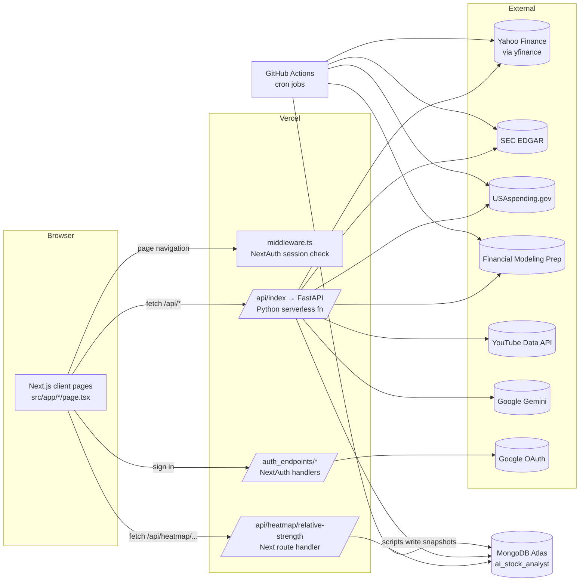
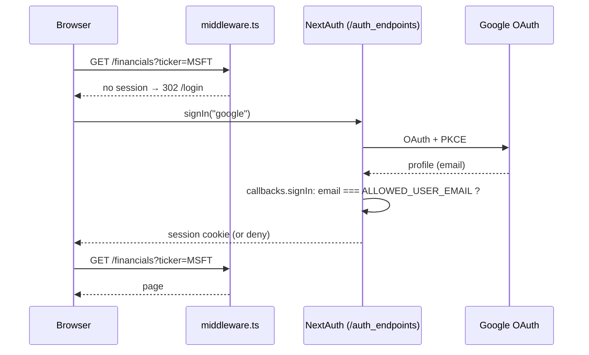
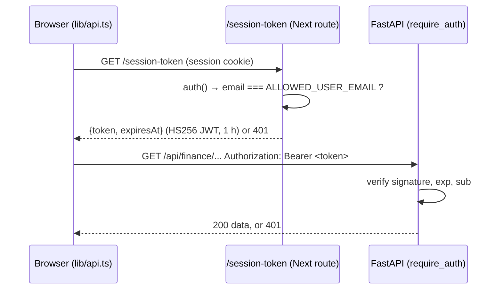
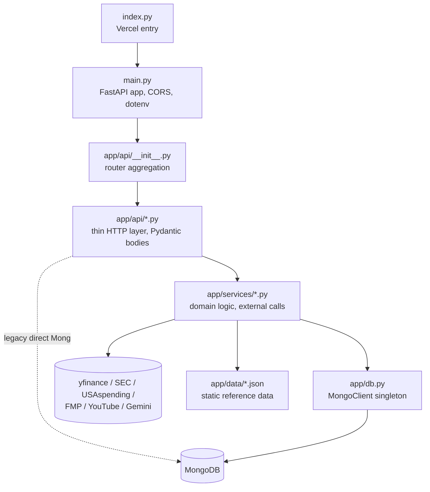
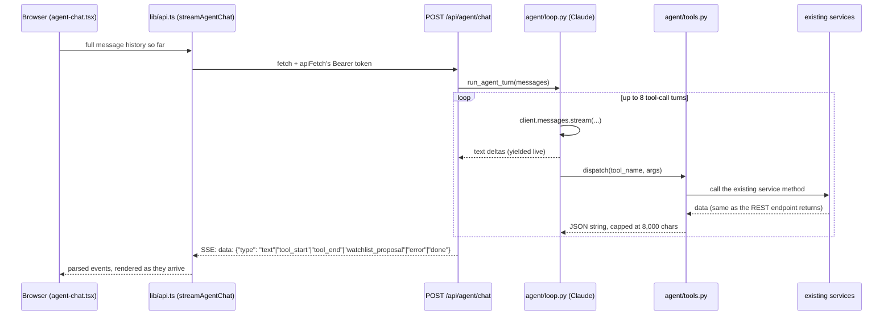
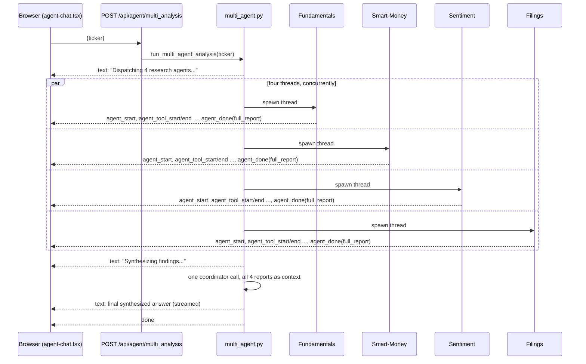

# AI Analyst: Architecture

This document describes how AI Analyst is built: the runtime topology, request and data flows, every module and endpoint, the MongoDB data model, the scheduled jobs, and the known technical debt. It reflects `master` as of 2026‑09. For day-to-day coding conventions, see [CLAUDE.md](../CLAUDE.md).

---

## 1. Overview

AI Analyst is a personal equity research dashboard. Enter a ticker and you get company fundamentals, financial statements, price charts, analyst forecasts, ownership, a Monte Carlo DCF valuation, brand sentiment, and LLM-written analyses (filing summaries, valuation, risk, technicals, macro, ETF quality). It also has market-wide views: an S&P 500 relative-strength heatmap, a "Future Leader" leaderboard, government-contractor book-to-bill, congressional trading, and institutional 13F trackers. A conversational analyst agent sits on top of all of this — a floating chat widget (bottom-right corner, on every page) backed by a tool-calling Claude agent you can ask real questions of. It shows its work live (which tools it's calling) and collapses that trace once it answers; it can propose, but never silently make, watchlist changes.

Only one person uses it. Google sign-in is restricted to one email address (`ALLOWED_USER_EMAIL`).

| Layer | Technology |
|---|---|
| UI | Next.js 16.1 (App Router), React 19.2, TypeScript 5 (strict), Tailwind CSS v4, shadcn/ui (new-york, Radix), Recharts 3, lucide-react, react-markdown, date-fns |
| Auth | NextAuth (Auth.js) v5 beta, Google provider, JWT session cookie |
| API | Python 3.12, FastAPI, Pydantic, uvicorn (local) |
| Data libs | yfinance, pandas, numpy, BeautifulSoup/lxml, vaderSentiment, httpx/requests |
| LLM | Google Gemini REST API (`gemini-3-flash-preview`, temperature 0.1) for one-shot analyses; Anthropic Claude (`claude-sonnet-5-5`, Messages API, tool use) for the chat widget |
| Storage | MongoDB Atlas, database `ai_stock_analyst` |
| Hosting | Vercel: Next.js plus a Python serverless function in one project |
| Scheduling | GitHub Actions cron workflows |

---

## 2. Runtime topology



### 2.1 How `/api/*` is routed

The same URL prefix reaches different servers depending on the environment:

| Environment | Where `/api/*` goes | Configured in |
|---|---|---|
| Dev | The browser calls `http://127.0.0.1:8000/api/...` **directly**, because `API_BASE_URL` in `src/lib/api.ts` points there. Relative `/api/*` requests (such as the heatmap route) are served by Next first, and the rest are proxied to `127.0.0.1:8000` | `src/lib/api.ts`, `next.config.ts` (dev-only `rewrites`) |
| Prod | Same-origin `/api/...`. Vercel serves the Next route handler if one matches the path, and otherwise rewrites to the Python function `api/index.py`, which imports `api/main.py:app` | `vercel.json`, `api/index.py` |

FastAPI mounts all routers under `/api` (`main.py: app.include_router(router, prefix="/api")`), so the path the function receives lines up with the routes.

NextAuth is moved to `/auth_endpoints` (`basePath` in `src/auth.ts`) so it doesn't collide with the `/api` proxy.

### 2.2 Authentication



- The middleware matcher is `/((?!api|auth_endpoints|session-token|_next/static|_next/image|favicon.ico).*)`, so the middleware protects **pages** only. The API is protected separately, as §2.3 describes.
- A custom PKCE cookie name is configured to work around Auth.js configuration errors behind Vercel (`AUTH_TRUST_HOST`, `AUTH_URL`).

### 2.3 API authentication

The FastAPI backend can't read the NextAuth session cookie: in dev it runs on a different host (`127.0.0.1:8000`), and the cookie is encrypted in an Auth.js-specific format. So the app uses a short-lived bearer token instead:



- **Signing key:** `HMAC-SHA256(AUTH_SECRET, "ai-analyst-api-token")`, derived the same way in `src/app/session-token/route.ts` and `api/app/auth.py`, so one secret serves both sides without being reused directly.
- **Client (`apiFetch` in `lib/api.ts`):** caches the token *promise*, so parallel requests share one fetch. It refreshes 60 s before expiry and retries once on a 401. If `/session-token` returns 401, it redirects to `/login`.
- **Server (`require_auth`):** attached to every router except `health` in `app/api/__init__.py`. It fails closed with a 500 if `AUTH_SECRET` is missing. If `ALLOWED_USER_EMAIL` is set, the token subject must match it.
- The Next heatmap route calls `auth()` itself and returns 401 without a session.

---

## 3. Frontend (`src/`)

### 3.1 Structure

```
src/
├── auth.ts                         NextAuth config (Google, single allowed email)
├── middleware.ts                   redirect unauthenticated page requests → /login
├── app/
│   ├── layout.tsx                  root html/body, Geist fonts, globals.css
│   ├── globals.css                 Tailwind v4 @theme + shadcn CSS variables (oklch)
│   ├── page.tsx                    "/" Overview dashboard (largest page, ~690 lines)
│   ├── <route>/page.tsx            one folder per feature page (see 3.3)
│   ├── api/heatmap/relative-strength/route.ts   Next route handler → Mongo
│   ├── auth_endpoints/[...nextauth]/route.ts    NextAuth GET/POST
│   ├── login/page.tsx              Google sign-in button
│   └── not-found.tsx
├── components/
│   ├── layout/dashboard-layout.tsx sidebar + header shell used by every page
│   ├── dashboard/*.tsx             feature components (charts, tables, trackers)
│   ├── heatmap/SnpHeatmap.tsx      Recharts Treemap of S&P 500
│   ├── watchlist/watchlist-table.tsx
│   └── ui/*.tsx                    shadcn/ui primitives
└── lib/
    ├── api.ts                      typed-ish fetch wrappers for every FastAPI endpoint
    ├── mongodb.ts                  MongoClient promise (HMR-safe global in dev)
    └── utils.ts                    cn(), formatLargeNumber()
```

### 3.2 Rendering model

Every page is a **client component** (`"use client"`), and data is fetched in the browser after mount. No React Server Component fetches data. The one server-side data path is the heatmap route handler (`revalidate = 3600`).

Each page follows the same shape:

```
export default Page  →  <Suspense fallback={spinner}>
                           <DashboardLayout>
                             <PageContent/>      ← reads ?ticker= via useSearchParams
                           </DashboardLayout>
                         </Suspense>
```

- **The ticker lives in the URL** (`?ticker=`). The header `TickerSearch` does a debounced (300 ms) call to `/api/sec/search` and then `router.push(`${redirectBase}?ticker=X`)`.
- **Sidebar ticker memory:** `DashboardLayout` saves the last *stock* ticker to `localStorage["lastStockTicker"]` and appends it to every nav link. The ETF page is excluded, so browsing ETFs doesn't replace the remembered stock.
- **State:** local `useState`/`useEffect` only. There is no global store, React Query, or SWR. Loading, empty, and data states are rendered by hand. AI results are held in `analysisResult` state and shown with `react-markdown`.
- **The one exception to "every page is its own tree":** `StockAnalystAssistant` (the chat widget, §4.4) is mounted once in `src/app/layout.tsx` — the actual Next.js root layout, which persists across client-side navigation — not inside `DashboardLayout`, which each page recreates. Inside it, the popup panel is always rendered and toggled with a CSS class (`open ? "flex" : "hidden"`), never `{open && <Panel/>}` — conditionally rendering it would unmount `AgentChat` (and wipe its conversation state) on every close, which is exactly the bug an early version of this shipped with.

### 3.3 Pages → endpoints → components

| Route | Purpose | `lib/api.ts` calls (→ FastAPI) | Main components |
|---|---|---|---|
| `/` | Overview: profile, key metrics with tooltips, SEC filings with AI summary, news with AI sentiment, AI valuation/risk, peers, Future Leader score, add to watchlist | `fetchCompanyInfo`, `fetchSECFilings`, `fetchCompanyNews`, `fetchFinancials`, `fetchPeerComparison`, `fetchHistoricalMetrics`, `fetchFutureLeaderScore`, `analyzeFiling`, `analyzeNews`, `analyzeValuation`, `analyzeRisk`, `addToWatchlist` | `financial-charts`, `peer-comparison`, `future-leader-score` |
| `/financials` | Quarterly income, balance sheet, cash flow, ratios | `fetchFinancials`, `fetchBalanceSheet`, `fetchCashFlow`, `fetchRatios` | `financial-table`, `financial-charts` |
| `/chart` | Price chart with period/interval, SMA overlays, comparisons, AI technicals | `fetchStockHistory` (+ `analyzeChart`, `fetchQuotes` in children) | `stock-chart`, `chart-analysis`, `sector-list`, `indicator-list` |
| `/simulation` | Monte Carlo DCF (WACC, growth override, bear case) | `runSimulation` | `dcf-histogram` |
| `/forecast` | Analyst targets/recommendations plus recent up/downgrades | `fetchForecast`, `fetchAnalystActions` | (inline) |
| `/ownership` | Insider/institution split, top holders, insider transactions | `fetchOwnership`, `fetchOwnershipDetails` | (inline) |
| `/sentiment` | Brand sentiment (Yahoo news + YouTube, VADER) | `fetchSentiment` | `sentiment-dashboard` |
| `/etf` | ETF overview, holdings, sector weights, chart, AI "Quality Core" analysis | `fetchCompanyInfo`, `fetchCompanyNews`, `fetchStockHistory`, `analyzeNews`; `analyzeEtf` (in `etf-ai-analysis`) | `etf-overview`, `etf-holdings`, `sector-allocation`, `etf-ai-analysis`, `stock-chart` |
| `/watchlist` | Saved tickers with live price/change | `getWatchlist`, `removeFromWatchlist` | `watchlist-table` |
| `/portfolio` | Demo portfolio: open positions with live gain/loss, closed positions with realized gain/loss (selling moves a position here, never deletes it) | `getPortfolio`, `addPortfolioPosition`, `sellPortfolioPosition`, `deletePortfolioPosition` | `portfolio-table` |
| `/finder` | Sector map or 3×3 style box of curated tickers with quotes | `fetchMarketMap`, `fetchQuotes` | (inline) |
| `/heatmap` | S&P 500 treemap coloured by 1m/3m/6m relative strength | `fetch('/api/heatmap/relative-strength')` (Next route → Mongo) | `heatmap/SnpHeatmap` |
| `/institutional` | Vanguard and Munro Partners 13F top buys/sells (tabs) | `fetchVanguardTrades`, `fetchMunroTrades` | `vanguard-tracker`, `munro-tracker` |
| `/house`, `/senate` | Congressional trades (Mongo snapshots) | `fetchHouseTrades`, `fetchSenateTrades` | `house-tracker`, `senate-tracker` |
| `/congress` | Combined live FMP feed (**not linked in the sidebar**) | `fetchCongressTrades` | `congress-tracker` |
| `/rankings` | Future Leader leaderboard by Small/Mid/Large cap, paginated | `fetchRankings` | (inline) |
| `/govt` | Government-contractor book-to-bill rankings | `fetchGovtRankings` | (inline) |
| `/macro` | Indices, rates, FX, commodities, economic indicators, sector ETFs, AI macro read | `fetchMacroData`, `fetchSectorPerformance`, `analyzeMacroMarket` | `macro-chart-card`, `sector-heatmap` |

`components/dashboard/simulation-chart.tsx` is not imported anywhere. `src/app/munro/` is an empty directory.

### 3.4 Styling

- Tailwind v4 is configured in CSS (`@import "tailwindcss"`, `@theme` in `globals.css`), so there is no `tailwind.config`. The shadcn tokens (`--background`, `--card`, `--primary`, `--chart-1..5`, …) are oklch CSS variables, and a `.dark` variant is declared.
- `components.json` sets up the shadcn CLI: new-york style, neutral base, lucide icons, RSC enabled, and aliases `@/components`, `@/lib`, `@/components/ui`.

---

## 4. Backend (`api/`)

### 4.1 Layering



- **Routers** (`app/api/*.py`) create their service instances **at import time**, as module-level singletons, and mostly just delegate to them.
- **Services** hold the logic. They catch exceptions internally, `print` the error, and return `None`, `[]`, or `{"error": ...}`. They rarely raise.
- **`app/db.py`** provides a lazy `MongoClient` singleton (`db.get_db()` → `ai_stock_analyst`) with a `certifi` CA bundle.
- **`main.py`** loads `api/.env`, sets CORS for `localhost:3000/3001`, and mounts everything at `/api`.

### 4.2 Endpoint catalogue

All paths are prefixed with `/api`.

| Method & path | Handler → service | Source | Notes |
|---|---|---|---|
| `GET /health` | health | — | `{"status":"ok"}` |
| **finance** | `finance.py` → `FinanceService` | | |
| `GET /finance/info/{ticker}` | `get_company_info` | yfinance `.info`, `funds_data` | Stock and ETF fields in one payload (`is_etf`, holdings, sector weights). 404 if none |
| `GET /finance/quotes?symbols=A,B` | `get_quotes` | yfinance | `[]` on failure |
| `GET /finance/history/{ticker}?period&interval` | `get_stock_history` | yfinance | OHLCV list |
| `GET /finance/news/{ticker}` | `get_company_news` | yfinance `.news` | |
| `GET /finance/financials/{ticker}` | `get_quarterly_financials` | yfinance | quarterly income statement |
| `GET /finance/financials/balance-sheet/{ticker}` | `get_quarterly_balance_sheet` | yfinance | |
| `GET /finance/financials/cash-flow/{ticker}` | `get_quarterly_cash_flow` | yfinance | |
| `GET /finance/financials/ratios/{ticker}` | `get_quarterly_ratios` | derived | |
| `GET /finance/historical-metrics/{ticker}` | `get_historical_metrics` | yfinance | |
| `GET /finance/peers/{ticker}` | `get_peer_comparison` | curated `peers_map` + yfinance | |
| `GET /finance/market-map?map_type=sector\|factor` | `get_sector_allocations` / `get_factor_allocations` | hard-coded ticker lists | |
| `GET /finance/macro` | `get_macro_indicators` | yfinance (indices, ^TNX, FX, futures) + `get_economic_data` (live FRED data, or a hardcoded 2024 snapshot if `FRED_API_KEY` is unset) | |
| `GET /finance/sectors` | `get_sector_performance` | SPDR sector ETFs (XLK…) | |
| `GET /finance/forecast/{ticker}` | `get_forecast` | yfinance analyst targets | |
| `GET /finance/forecast/actions/{ticker}` | `get_analyst_actions` | yfinance `upgrades_downgrades` | latest 30 |
| `GET /finance/ownership/{ticker}` | `get_ownership` | yfinance `major_holders` | |
| `GET /finance/ownership/details/{ticker}` | `get_ownership_details` | yfinance institutional + insider | |
| `GET /finance/score/{ticker}` | `get_future_leader_score` | yfinance | see §5.2 |
| `GET /finance/rankings?category&page&limit` | `get_rankings` | Mongo `leaderboard` → fallback: live score on a random sample of 20 | paginated `{data,total,page,limit}` |
| `GET /finance/govt/backlog/{ticker}` | `get_govt_backlog` | USAspending + yfinance | live book-to-bill |
| `GET /finance/govt/rankings` | `get_govt_rankings` | Mongo `govt_contracts` | |
| **sec** | `sec.py` → `SECService` | | |
| `GET /sec/filings/{ticker}` | `get_filings` | `data.sec.gov/submissions` | 10‑K/10‑Q/20‑F/6‑K links |
| `GET /sec/search?query=` | `search_tickers` | in-memory list built from `company_tickers.json` plus about 100 hard-coded ETFs | powers header search |
| **ai** | `ai.py` → `AIService` (+ Finance/SEC services) | Gemini | |
| `POST /ai/analyze_filing {ticker,url}` | `summarize_filing` | SEC HTML → first 30k chars | returns `{summary}` |
| `POST /ai/analyze_news {ticker,news[]}` | `analyze_news_sentiment` | client-supplied headlines | `{analysis}` |
| `POST /ai/analyze_chart {ticker,period,interval}` | `analyze_chart_data` | last 60 OHLCV bars | **returns a bare string** |
| `POST /ai/analyze_valuation {ticker}` | `analyze_valuation` | info + quarterly financials | `{analysis}` |
| `POST /ai/analyze_risk {ticker}` | `analyze_risk` | info + financials + ownership | `{analysis}` |
| `POST /ai/analyze_macro_market {macro_data,sector_data}` | `analyze_macro_market` | client-supplied | `{analysis}` |
| `POST /ai/analyze_etf {ticker}` | `analyze_etf_quality` | `FinanceService.get_etf_details` | `{analysis}` |
| **sentiment** | `SentimentService` | | |
| `GET /sentiment/{ticker}` | `get_brand_sentiment` | yfinance news + YouTube search/comments → VADER | NSS, distribution, emotions, keywords, posts |
| **simulation** | `SimulationService` | | |
| `POST /simulation/run {ticker,wacc,growth_rate_mean,simulations,bear_case}` | `run_dcf_simulation` | yfinance annual statements | `lru_cache(32)`; see §5.1 |
| **watchlist** | router talks to Mongo directly | | |
| `GET /watchlist` | — | Mongo `watchlist` + yfinance `fast_info` per ticker | |
| `POST /watchlist {ticker}` | — | yfinance `.info` for name | idempotent |
| `DELETE /watchlist/{ticker}` | — | Mongo | 404 if absent |
| **portfolio** | router talks to Mongo directly, same pattern as watchlist | | demo portfolio, not a real brokerage link; see §4.6 |
| `GET /portfolio` | — | Mongo `portfolio` + `FinanceService.get_quotes()` | `{open: [...], closed: [...]}`, each enriched with live price / gain-loss |
| `POST /portfolio {ticker,shares,cost_basis}` | — | Mongo | 400 if an open position already exists for that ticker |
| `POST /portfolio/{ticker}/sell` | — | Mongo + live quote | sets `status: "closed"` + `sell_price`/`sell_date` — never deletes the document |
| `DELETE /portfolio/{position_id}` | — | Mongo | for correcting a mistaken manual entry, not for selling |
| **trackers** | | | |
| `GET /vanguard/trades?limit` | `InstitutionService.get_vanguard_trades` | Mongo `vanguard_tracker` → fallback live 13F diff | |
| `GET /munro/trades?limit` | `InstitutionService.get_munro_trades` | Mongo `munro_tracker` → fallback live | |
| `GET /house/trades` | router → Mongo `house_tracker` | snapshot | `{trades, updated_at}` or `status:no_data` |
| `GET /senate/trades` | router → Mongo `senate_tracker` | snapshot | same |
| `GET /congress/trades?limit` | `CongressService` | live FMP `stable/senate-latest` and `house-latest` | |
| **agent** | `agent.py` → `agent/loop.py` + `agent/tools.py` | Anthropic Claude | see §4.4 |
| `POST /agent/chat {messages}` | `run_agent_turn` | tool-use loop over 29 tools wrapping the services above, plus whatever an external MCP server dynamically exposes (3, as of writing) | `text/event-stream`, not JSON |
| `POST /agent/multi_analysis {ticker}` | `run_multi_agent_analysis` | 4 concurrent subagents (threads), each a mini tool-loop over a filtered slice of the same tool registry | see §4.6; `text/event-stream` with its own nested event types on top of `text`/`error`/`done` |
| `POST /agent/ingest_filing {ticker,accessionNumber,form,filingDate,link}` | `FilingSearchService.ingest_filing` | SECService + Pinecone | see §4.5; same primitive the `search_filings` tool's lazy fallback uses |
| `GET /agent/filing_status?ticker&accessionNumbers` | `FilingSearchService.get_indexed_status` | one Pinecone `fetch()` call | `{accessionNumber: bool}`; drives the upload button's disabled/checked state |

### 4.3 Services

| Service | File | Responsibility |
|---|---|---|
| `FinanceService` | `services/finance.py` (~1,700 lines) | Nearly all market data through yfinance: company/ETF info, quotes, history, statements, ratios, forecasts, ownership, macro, sectors, peers, style box, Future Leader score, rankings, USAspending book-to-bill. `_sanitize_data()` recursively converts NaN/Inf to `None` and numpy scalars to Python types. |
| `AIService` | `services/ai.py` | One transport method, `generate_insight(prompt)` (sync `httpx.Client`, 30 s timeout, Gemini `generateContent`), plus one prompt-builder per analysis. On failure it returns error *strings* and never raises. |
| `SECService` | `services/sec.py` | Downloads the SEC `company_tickers.json` **in `__init__`** to build the ticker→CIK map and search cache, adds popular ETFs, lists filings, and fetches and cleans filing text with BeautifulSoup. The User-Agent comes from `SEC_USER_AGENT`, as SEC requires. |
| `InstitutionService` | `services/institution_service.py` | 13F tracker for Vanguard (CIK 0000102909) and Munro (CIK 0001768744). It reads Mongo first. Otherwise it fetches the last two 13F‑HR filings, scrapes the index page for the info-table XML, parses holdings, merges on CUSIP, resolves issuer→ticker through the SEC title map, and ranks by value change. |
| `SimulationService` | `services/simulation.py` | Monte Carlo DCF (numpy). |
| `SentimentService` | `services/sentiment_service.py` | Brand-name resolution (manual map, then yfinance name with legal suffixes stripped), Yahoo news, YouTube (top 5 "<brand> Review" videos from the last 30 days plus 5 comments each), VADER scoring, lexicon emotions, keyword counts. |
| `CongressService` | `services/congress_service.py` | Live FMP fetch of both chambers, normalised and sorted by disclosure date. |

### 4.4 Conversational analyst agent

A tool-calling Claude agent, deliberately separate from `AIService`'s one-shot Gemini prompts (§4.3). It's **interactive only** — there is no scheduled/autonomous counterpart (a "Path B" of proactive digests was scoped and deliberately dropped; see the design decision log for that feature). Everything it can do, it does by fetching live data in response to a question, not from a cache.

**UI: a floating widget, not a page.** `StockAnalystAssistant` (`stock-analyst-assistant.tsx`) renders a chat-bubble button fixed to the bottom-right corner on every page, and a popup panel that toggles open. It's mounted once in the true root layout (`src/app/layout.tsx`), not inside `DashboardLayout`, specifically so the conversation survives client-side navigation between pages — see §3.2 for why that placement matters and the exact bug it avoids. Hidden on `/login` (`usePathname() === "/login"` check), since there's no session to chat with yet there.

**Live, collapsible tool-call trace.** While a turn is in progress, `agent-chat.tsx` shows each tool call as it starts and completes (spinner → checkmark), directly under the message — visible "thinking," similar to Claude Code's own CLI output. Once the turn finishes, that trace collapses into a "Used N tools" toggle; the final answer text is always shown in full below it, never collapsed. Each `DisplayMessage` carries its own `toolCalls` array and `streaming`/`traceExpanded` flags client-side — none of this is sent to or read from the backend, which only ever sees plain `{role, content}` pairs (see "Conversation state" below).



**Tool registry (`agent/tools.py`):** 29 static tools, one per existing service method (fundamentals, financials, history, ownership, forecasts, peers, Future Leader score, rankings, news, brand sentiment, Vanguard/Munro 13F, Congress trades, macro, sector performance, DCF simulation, SEC filings, watchlist read) plus one semantic-search tool (`search_filings`, §4.5), two cross-referencing/orchestration tools (`find_smart_money_convergence` and `get_investment_verdict`, below), and one that isn't a data fetch at all: `propose_watchlist_add`. Large payloads (price history, trade lists, filing text, the DCF histogram) are trimmed in the tool wrapper before being handed to the model — not in the underlying service, which is untouched. See CLAUDE.md "Conversational analyst agent" for how to add one. On top of these, `loop.py` dynamically appends whatever an external MCP server currently exposes (below) — those aren't part of this static list at all.

**Smart-money convergence (`smart_money_service.py`):** `find_smart_money_convergence` cross-references three *existing, independently-fetched* signals — Congress trades, Vanguard's latest 13F, and Munro Partners' latest 13F — for tickers where at least 2 of the 3 agree on direction, then enriches each with its Future Leader score and its sector's current performance, so you can see whether the convergence is happening in a hot or cold sector. This logic lives in its own service, not inlined into `agent/tools.py` or bolted onto `FinanceService`, because it genuinely combines multiple services rather than wrapping one. One non-obvious piece: yfinance's sector names (`"Consumer Cyclical"`, `"Financial Services"`, …) don't match the SPDR/GICS names `get_sector_performance()` uses (`"Consumer Discret."`, `"Financials"`, …) — `YFINANCE_TO_SPDR_SECTOR` in that file cross-walks the two. Slow (~10s for a full scan), same tolerance band as `run_dcf_simulation`. `SmartMoneyService.get_ticker_signal(ticker)` is the cheap, single-ticker sibling of the same underlying three-source fetch (refactored into a shared `_build_signals()`/`_classify()` so the two don't duplicate logic) — used by `get_investment_verdict`, not exposed as its own tool.

**Investment verdict (`get_investment_verdict`, in `agent/tools.py` directly):** bundles fundamentals/valuation ratios, a 4-quarter revenue/earnings trend, analyst forecast and recent actions, the Future Leader score, `get_ticker_signal`, and brand sentiment into one tool call, so a "Buy, Hold, or Sell?" question doesn't depend on the model remembering to chain 6+ separate tools in the right order. Thin enough (mostly "call several existing things and trim the result") that it lives directly in `tools.py` rather than its own service file, unlike `smart_money_service.py`, which has real matching logic of its own. **Deliberately excludes the DCF simulation** — too slow to bundle by default — though the model can still call `run_dcf_simulation` separately, and its own description says so. Each sub-piece is trimmed to verdict-relevant fields before bundling (e.g. `get_company_info`'s ~35 fields, including a long business-summary string and an executive list, become ~19 fields), keeping the combined payload around 3.5 KB in practice — well inside `dispatch()`'s 8,000-character cap even before that cap's own truncation-with-marker fallback would need to kick in.

**MCP client (`agent/mcp_client.py`):** every tool in the static registry above calls an in-process service method directly. This is this app's one real MCP *client* integration, and it's dynamic, not a hand-wired tool: the backend spawns the [DuckDuckGo MCP server](https://github.com/nickclyde/duckduckgo-mcp-server) (`duckduckgo-mcp-server`, installed from `requirements.txt`) as a subprocess, speaks the Model Context Protocol to it over stdio, and asks it what tools it currently exposes — as of writing, `search`, `fetch_content` (read a full page from a search result), and `expand_link` (resolve a shortened `ref://` token back to a real URL); no resources or prompts. No API key — it's a free, unauthenticated wrapper around DuckDuckGo's own search and page-fetching, chosen specifically so this doesn't cost anything per call (unlike Anthropic's own hosted `web_search` server tool, which bills per query and was considered and rejected for that reason).

```
loop.py: all_tools = TOOLS + mcp_client.discover_tools()   [once per user turn]
                                      │
                                      ▼
                    mcp_client.discover_tools()   [agent/mcp_client.py]
                         │  anyio.run() → Client(...).list_tools()
                         │  converts MCP's tool schema straight into
                         │  Anthropic's {name, description, input_schema}
                         │  shape - no hand-written schema anywhere
                         ▼
        mcp.client.stdio: spawns `duckduckgo-mcp-server` as a subprocess,
        asks it what it exposes over stdin/stdout
                         │
                         ▼
              [whatever the server currently returns]

  ── when the model calls one of those tools ──

tools.py: dispatch(name, args)
        │  name not in the static TOOL_DISPATCH
        ▼
mcp_client.call_tool(name, args)   [agent/mcp_client.py]
        │  anyio.run() — bridges into the mcp SDK's async Client from
        │  this app's synchronous dispatch() call chain
        ▼
mcp.client.stdio: spawns the subprocess again, calls the named tool
        │
        ▼
DuckDuckGo
```

Nothing in this codebase names `search`, `fetch_content`, or `expand_link` directly — `discover_tools()`'s result is cached after the first successful call (so a warm serverless instance reuses it instead of re-spawning the server just to ask what it can do) and merged into the tool list fresh each turn; `dispatch()` routes any tool name it doesn't recognize as one of the static 29 through `mcp_client.call_tool()` instead. If the DuckDuckGo server's own tool list changes, or it's swapped for a different MCP server entirely, this app's available tools change with no code change here. `SYSTEM_PROMPT` steers Claude to prefer the specific data tools for anything about a ticker, and reach for the general web tools only for breaking news, macro/Fed questions (`get_macro_indicators`' data is a point-in-time snapshot, not live), or anything outside a ticker entirely — confirmed in testing that the model will chain `search` → `fetch_content` on its own when a search snippet alone isn't enough, and that a failed `fetch_content` call (a source returning a 403, for instance) surfaces as a normal tool error through the same `dispatch()` path as any static tool's failure, rather than derailing the turn — the model just notes the source was unavailable and answers from whatever it could retrieve. This is also the first thing in this app that spawns a subprocess at request time; getting it working reliably on Vercel took a few rounds (console-script entry points aren't materialized in Vercel's Python runtime the way a normal pip install creates them, and a freshly spawned subprocess doesn't inherit the extra `sys.path` entries Vercel's own bootstrap injects into the parent process) — see the git history on `agent/mcp_client.py` for the specifics if you're touching it.

**The gated watchlist write:** `propose_watchlist_add` never touches MongoDB. Its dispatch function just returns a "proposed, not added" acknowledgement to the model, and the loop separately emits a `watchlist_proposal` SSE event carrying the ticker and reason. `agent-chat.tsx` renders that as a Confirm/Dismiss card; clicking Confirm calls the **existing, already-authenticated** `addToWatchlist()` (`POST /api/watchlist`) — the same function the Watchlist page uses. The agent's Python code has no code path that can write to the watchlist on its own.

**Wire format:** `text/event-stream`, one `data: {...}\n\n` JSON frame per event (`type` is one of `text`, `tool_start`, `tool_end`, `watchlist_proposal`, `error`, `done`). This is real SSE framing, but it's consumed by a hand-rolled reader over `fetch()` + `ReadableStream` (`streamAgentChat` in `lib/api.ts`), not the browser's native `EventSource` — `EventSource` can't send the `Authorization: Bearer` header this API requires.

**Conversation state:** client-side only (React state in `agent-chat.tsx`). Each request sends the full visible text history; nothing is persisted server-side, and a page refresh loses it. Tool calls from earlier turns aren't replayed to the model on a new turn — only the resulting text is, since the wire format carries plain `{role, content: string}` pairs, not full Anthropic content blocks. A deliberate v1 simplification, not an oversight.

**Model split:** Claude (`claude-sonnet-5-5`, direct `anthropic` SDK, tool use), not Gemini — the one-shot `AIService` prompts are unaffected and unchanged. Requires its own `ANTHROPIC_API_KEY` in `api/.env` / Vercel, separate from `GEMINI_API_KEY`.

**Safety boundaries:** read-only except two gated write actions — the watchlist proposal above, and the position-aware trade proposal the multi-agent coordinator can make (§4.6) — both confirm-before-write, neither auto-executes. No real trading or brokerage integration, none planned; the portfolio these trade proposals write to is a demo/fake one (§4.6), not connected to any real account. Capped at 8 tool-call turns and 2,048 output tokens per turn (`MAX_TOOL_TURNS`, `MAX_TOKENS` in `loop.py`) — both a UX bound (interactive requests need to finish quickly) and a cost bound (each turn is a billed Claude API call). Sits behind `require_auth` like every other router — no special-casing.

### 4.5 RAG over SEC filings

`search_filings` (one of the 29 tools above) answers questions that need to search *across* a ticker's filings, rather than read one you already have a URL for (`get_filing_text`'s job) — "find mentions of margin pressure across everything ONON has filed."

```
search_filings(ticker, query)
        │
        ▼
FilingSearchService._has_data(ticker)?  (Pinecone describe_index_stats)
        │                                      │
    no data yet                            has data
        ▼                                      │
ingest_ticker_filings(ticker, max_filings=2)    │
  → SECService.get_filings/get_filing_text      │
  → chunk (1200 chars, 150 overlap)              │
  → index.upsert_records(records, namespace=ticker)
        │                                      │
        └──────────────────┬───────────────────┘
                            ▼
        index.search(namespace=ticker, inputs={"text": query}, top_k=limit)
                            │
                            ▼
              top-K {chunk_text, form_type, filed_date, url}
```

**Pinecone does the embedding, both ways.** The index (`sec-filings`, created once by `api/utils/create_pinecone_index.py`) uses `create_index_for_model` with `llama-text-embed-v2` — `upsert_records` and `search` both take raw text; there's no separate embeddings API call or key anywhere in this codebase. One **namespace per ticker**, so scoping never needs Pinecone's metadata-filter syntax.

**One ingestion primitive, three callers**, all in `FilingSearchService`:
- `ingest_filing(ticker, filing)` — ingests exactly one filing. Record `_id`s are `{ticker}-{accessionNumber}-{chunk_index}`, so re-ingesting the same filing is a harmless no-op upsert.
- `ingest_ticker_filings(ticker, max_filings=2)` — loops the above over the most recent filings. Used as `search_filings`'s **lazy fallback** when a ticker's namespace is empty, bounded to 2 filings so a first-time question doesn't stall the chat waiting on a full history.
- The standalone script `api/utils/ingest_filings.py TICKER [TICKER...] [--max-filings N]`, and the **upload button** next to each filing in the Overview page's "Recent SEC Filings" list (`POST /api/agent/ingest_filing`, one filing at a time) — both pre-populate ahead of ever asking, so the first real question doesn't pay the ingestion latency.

**Already-indexed status:** right after the Overview page loads a ticker's filings, it calls `GET /agent/filing_status` with all their accession numbers in one request. `get_indexed_status()` checks each filing's first chunk id (`{ticker}-{accessionNumber}-0`) via a single Pinecone `fetch()` call — `fetch()` only returns ids that actually exist, so the response is a plain `{accessionNumber: bool}` map, no per-filing round-trip needed. Already-indexed filings render their upload button permanently disabled with a checkmark, instead of inviting a redundant (harmless but wasteful) re-upload; a fresh upload updates this optimistically client-side the moment it succeeds, without waiting on a second status fetch.

**Verified against the installed SDK, not just its docs** (see CLAUDE.md's Pinecone gotcha for the specific divergences found) — `upsert_records`/`search` are keyword-only, `search`'s `top_k`/`inputs` are flat kwargs, and `Hit` objects use `score` not `_score`.

### 4.6 Multi-agent stock research

A dedicated action, not a conversational tool call — a distinct button in the chat widget triggers `POST /agent/multi_analysis {ticker}`, which streams from `agent/multi_agent.py`'s `run_multi_agent_analysis()` rather than `loop.py`'s `run_agent_turn()`. Deliberately not modeled as one more entry in `TOOL_DISPATCH`: `dispatch()` is a simple synchronous call-and-return that 29+ tools rely on, and this needs to stream nested progress (one live tool trace per subagent, running concurrently) during a single "call" — forcing that through `dispatch()`'s contract would complicate every other tool's calling convention to serve this one unusual case. It's a sibling flow instead, with its own endpoint and its own SSE event vocabulary layered on top of the shared `text`/`error`/`done` events.



**Four fixed personas** (`PERSONAS` in `multi_agent.py`), each a focused mini tool-loop over a *filtered slice* of the normal `TOOLS` registry — Fundamentals & Valuation, Smart-Money & Institutional, Sentiment & News (the only persona with `include_mcp_tools: True`, since general web search is only relevant to this angle), and Filings & Risk. The set is deliberately fixed and deterministic, not dynamically decided by an LLM — simpler, cheaper, predictable, and it mirrors how `get_investment_verdict` is already a known bundle rather than an open-ended decision.

**Concurrency without async:** this app is sync throughout (yfinance, the Anthropic SDK's sync client, MCP's `anyio.run()` bridge), so the four subagents run in plain `threading.Thread`s, not asyncio tasks. Each thread pushes its events onto a shared `queue.Queue()`; the main generator just pulls from that queue and yields whatever arrives, in real arrival order, until all four threads have each pushed a terminal `agent_done` - this is what merges four independent, concurrently-running generators into one ordered SSE stream.

**A design tension worth naming:** this runs philosophically against `get_investment_verdict`'s whole reason for existing. That tool was built specifically to *cut* tool calls and token cost (measured: 60.9% savings) by bundling everything into one call instead of letting the agent chain many. Multi-agent research deliberately goes the other way — roughly 5 separate Claude API calls per invocation (4 subagents + 1 coordinator) instead of 1-2 for a normal chat turn. That's an accepted tradeoff here: the feature exists to demonstrate real multi-agent capability (each subagent gets its own focused context and tool subset, and the UI shows four independent live traces running in parallel, not one call pretending to be four), not to minimize cost - it's used occasionally and deliberately, not on every chat turn.

**Two real bugs found in live testing, both about a subagent's final report coming back empty despite its tool calls having succeeded:**
1. **Turn-budget exhaustion.** `MAX_TOOL_TURNS` originally at 4 was too low for personas with more available tools (fundamentals has 8) - the loop could run out of turns while still mid-research, before ever reaching a turn that writes a conclusion.
2. **Thinking tokens consuming the entire output budget.** A live test showed a turn with `stop_reason="max_tokens"` where *all* of a 1024-token budget went to invisible thinking tokens, leaving zero for visible text - a technically "finished" turn with nothing to show for it.

Both get caught by the same `needs_fallback` mechanism in `_run_subagent`: if the loop exhausts, or a turn finishes without producing visible text, one more tool-free call is forced, asking the model to write up whatever it already found from the conversation history rather than let the report ship empty.

**UI: Level B, not Level A.** The chat widget renders one card per subagent, each showing its *own* live, nested tool trace (reusing the same spinner/checkmark pattern the single-agent trace already uses, just instantiated once per persona) - not just a single "4 agents ran" summary line. That nesting was a deliberate choice over a simpler flat design: the point of the feature is demonstrating that four agents each independently researched something, which only reads as true if you can see each one's own tool calls, not just that four things happened. Each subagent's full written report is available via an expand/collapse toggle once it finishes, independent of the others.

**Position-aware verdict and the gated trade proposal.** Before the coordinator's synthesis call, `run_multi_agent_analysis()` looks up whether the user holds an open position in this ticker (`_get_open_position()`, one Mongo query against the `portfolio` collection - §4.7) and passes it to the coordinator as plain text context, the same way the four subagent reports already are. `COORDINATOR_SYSTEM_PROMPT` asks for an explicit hold-vs-sell read (framed against the actual cost basis and gain/loss) if a position exists, or buy-vs-pass if not - and to call a new `propose_trade(ticker, action, reason)` tool only when the synthesis genuinely supports a buy or sell, not on every analysis. This is read, not a free-text pattern the backend parses: `propose_trade` is a real Anthropic tool-use call, mirroring `propose_watchlist_add`'s shape exactly, and - like that tool - it's terminal (the model's full synthesized text and the tool call can arrive in the same response; there's no result to feed back for the conversation to continue). The backend reads the `tool_use` block straight off `final_message.content` after streaming and emits a `trade_proposal` SSE event; nothing is written to the portfolio until the user confirms the resulting card. Verified live, twice: a synthetic, deliberately one-sided bullish scenario correctly produced a `propose_trade(action="buy")` call with a grounded reason, and two real runs against genuinely mixed evidence correctly produced *no* tool call, with the coordinator explaining in its text why it wasn't proposing a trade - confirming the "only when it's warranted" instruction actually holds, not just that the tool fires on request.

### 4.7 Portfolio

A demo portfolio, not a real brokerage link - MongoDB collection `portfolio`, one document per position, read and written directly by `app/api/portfolio.py` (same router-talks-to-Mongo-directly shape as `watchlist.py`, not a separate service class, since the logic here is comparably simple: CRUD plus live-quote enrichment via the already-parallelized `FinanceService.get_quotes()`). Simplification: **at most one open position per ticker at a time**, which is what keeps `POST /portfolio/{ticker}/sell`'s lookup unambiguous (there's at most one open document to close) rather than needing to track multiple lots.

**Selling moves a position, never deletes it.** The sell endpoint sets `status: "closed"` plus `sell_price`/`sell_date` on the same document; the Portfolio page's Closed Positions table reads directly off that to show buy price, sell price, sell date, and realized gain/loss. `DELETE /portfolio/{id}` exists separately, for correcting a mistaken manual entry - a different action from selling, and the only code path that actually removes a document.

This is also where the multi-agent coordinator's position-aware verdict (§4.6) gets its data, and where a confirmed trade proposal actually writes: buy confirms call `POST /portfolio` with a placeholder share count (`PLACEHOLDER_BUY_SHARES` in `agent-chat.tsx`) at the ticker's live price fetched fresh at confirm time; sell confirms call `POST /portfolio/{ticker}/sell`, which independently fetches its own live price rather than trusting any price the coordinator saw mid-analysis.

---

## 5. Key algorithms

### 5.1 Monte Carlo DCF (`SimulationService.run_dcf_simulation`)

1. Pull up to 5 years of annual revenue and FCF from yfinance. If FCF is missing, compute it as OCF + CapEx. Get net debt from `totalDebt - totalCash`, and price and shares from `fast_info`.
2. Estimate the mean and standard deviation of historical revenue growth and FCF margin. The user's `growth_rate_mean` overrides the growth mean. The base case assumes FCF margins expand toward a target of 18% and a terminal growth rate of 2.5%. `bear_case` changes these assumptions: growth mean −1.5σ, WACC +200 bp, margin −5 pts, target margin 12%, terminal growth 1.5%.
3. Simulate `N` (default 10,000) paths of projected revenue × margin, discount at `wacc` (default 9%), and add a terminal value.
4. Compute equity value = EV − net debt, then per share. Negatives are floored at 0.
5. Output: median (`expected_value`), 25th percentile (`buy_zone_price`), P(value > price) (`win_probability`), P(value < 70% of price) (`max_drawdown_prob`), a 50-bin density histogram, and the assumptions used.

### 5.2 Future Leader score (`FinanceService.get_future_leader_score`, 0–10)

| Factor | Max pts | Pass rule |
|---|---|---|
| Growth efficiency: Rule of 40 (revenue growth % + profit margin %) | 3.0 | >40 full, >20 half |
| Innovation intensity: R&D / revenue | 2.5 | ≥15% |
| Scalability: operating leverage | 2.0 | revenue growth > opex growth |
| Market value: PEG (computed as forward P/E ÷ growth if missing) | 1.5 | low positive PEG (<1.0 full, <1.5 partial) |
| Management: ROIC | 1.0 | >15% |

`/rankings` is served from the `leaderboard` snapshot, which `api/utils/generate_leaderboard.py` builds by scoring every constituent in `app/data/sp_indices.json` (S&P 600 / 400 / 500, scraped from Wikipedia by `utils/fetch_tickers.py`).

### 5.3 Government book-to-bill (`get_govt_backlog`)

Book-to-bill = contract awards over the last 90 days (USAspending `spending_by_award`, award types A–D, searched by UEI or company keyword) ÷ quarterly revenue. `utils/build_uei_mapping.py` maintains `app/data/uei_mapping.json`, and `utils/generate_govt_contracts.py` precomputes the results for known contractors (LMT, RTX, GD, NOC, …) into `govt_contracts`.

### 5.4 Brand sentiment

VADER compound ≥ 0.05 is positive and ≤ −0.05 is negative. **NSS** = (pos − neg) / total × 100. Emotions come from keyword-lexicon hits. Trends are the top 10 non-stopword tokens.

---

## 6. Data model (MongoDB `ai_stock_analyst`)

Most collections hold **precomputed snapshot documents** that batch jobs replace wholesale. They are not incrementally updated entities.

| Collection | Document shape | Writer | Reader |
|---|---|---|---|
| `watchlist` | `{ticker, name}` per ticker | `POST /watchlist` | `GET /watchlist` |
| `portfolio` | `{ticker, shares, cost_basis, purchase_date, status: "open"\|"closed", sell_price, sell_date}` per position - demo portfolio, not a real brokerage link; see §4.7. Selling updates the same document in place (`status`, `sell_price`, `sell_date`), never deletes it | `POST /portfolio`, `POST /portfolio/{ticker}/sell` (manual or confirmed trade proposal, §4.6) | `GET /portfolio` |
| `leaderboard` | `{_id: "small_cap"\|"mid_cap"\|"large_cap", companies: [{ticker, rank, total_score, factors}], last_updated}` | `utils/generate_leaderboard.py` (every 12 h), `utils/migrate_mongo.py` (one-off) | `FinanceService.get_rankings` |
| `govt_contracts` | `{_id: "contractors", companies: [...]}` | `utils/generate_govt_contracts.py` (daily) | `get_govt_rankings` |
| `vanguard_tracker`, `munro_tracker` | two docs: `{type: "buy"\|"sell", data: [...100], report_date, prev_report_date}` | `scripts/update_vanguard_data.py` (weekly), `scripts/update_munro_data.py` (manual, no workflow) | `InstitutionService._get_from_db` |
| `house_tracker`, `senate_tracker` | `{type: "recent_trades", data: [...], updated_at}`, accumulated, de-duplicated, and sorted on each run | `scripts/update_house_data.py`, `update_senate_data.py` (daily) | `house.py`, `senate.py` routers |
| `snp_heatmap_data` | one doc per S&P 500 ticker: `{ticker, sector, market_cap, relative_strength: {"1m","3m","6m"}, ...}` (bulk upsert) | `scripts/update_snp_heatmap.py` (weekdays 21:30 UTC) | **Next.js** route `/api/heatmap/relative-strength` |

Static reference data in the repo: `api/app/data/sp_indices.json`, `uei_mapping.json`, and `leaderboard.json` (the legacy seed).

---

## 7. Batch jobs and scheduling

| Workflow | Cron (UTC) | Script | Secrets | Python |
|---|---|---|---|---|
| `update_leaderboard.yml` | `0 */12 * * *` | `api/utils/generate_leaderboard.py` | `MONGO_URI` | 3.13 |
| `update_govt_spending.yml` | `0 0 * * *` | `api/utils/generate_govt_contracts.py` | `MONGO_URI` | 3.13 |
| `update_house.yml` | `0 2 * * *` | `api/scripts/update_house_data.py` | `MONGO_URI`, `FMP_API_KEY` | 3.11 |
| `update_senate.yml` | `15 2 * * *` | `api/scripts/update_senate_data.py` | `MONGO_URI`, `FMP_API_KEY` | 3.11 |
| `update_snp_heatmap.yml` | `30 21 * * 1-5` | `api/scripts/update_snp_heatmap.py` | `MONGO_URI` | 3.9 |
| `update_vanguard.yml` | `0 0 * * 0` | `api/scripts/update_vanguard_data.py` | `MONGO_URI` (passed as `MONGODB_URI`) | 3.11 |

All workflows also support `workflow_dispatch`. The scripts add `api/` to `sys.path` so they can reuse `app.services.*`, and they load dotenv optionally so they also run locally.

**Why this pattern exists:** 13F XML parsing, scoring about 1,500 tickers, and paid or rate-limited APIs are far too slow for a Vercel function's time limit. So the function reads a snapshot, and the heavy work runs in Actions.

---

## 8. Configuration and deployment

- **Vercel project:** the Next.js build plus `api/index.py` as a Python function. `api/runtime.txt` is `python-3.12`, and `api/requirements.txt` is kept minimal because of the function size limit (a commit titled "Reduced serverless function size").
- **Environment variables:** see the table in [CLAUDE.md](../CLAUDE.md#environment-variables). The frontend reads `.env.local`, the backend reads `api/.env` (loaded by `main.py`), and CI reads GitHub secrets. `ANTHROPIC_API_KEY` (backend only) needs to be set on Vercel too, or the chat widget fails with a graceful in-chat error rather than working.
- **Local development:** run `uvicorn main:app --reload --port 8000` from `api/` and `npm run dev` from the root. The Python virtualenv is `.venv/` at the repo root.
- **Branching:** feature branches (`scalping`, `ETF`) are merged by PR into `master`, with Conventional Commit messages.

---

## 9. Known issues and technical debt

Ordered roughly by priority.

| # | Area | Issue | Suggested direction |
|---|---|---|---|
| 1 | ~~Security~~ | ✅ **Fixed.** `api/.env.example` holds placeholders only now; the real values that were briefly committed should still be treated as burned (rotate them if that hasn't happened). | — |
| 2 | ~~Security~~ | ✅ **Fixed.** FastAPI endpoints now require a session token (§2.3). | — |
| 3 | ~~Bug~~ | ✅ **Fixed.** `etf-ai-analysis.tsx` now uses `analyzeEtf()` from `lib/api.ts` instead of `localhost:8000`. | — |
| 4 | Performance | Many `async def` handlers (in `finance.py`, `ai.py`, `watchlist.py`, `simulation.py`) call blocking yfinance, httpx, and pymongo, which blocks the event loop. | Change them to `def` so FastAPI runs them in its threadpool. |
| 5 | Performance | `SECService()` downloads `company_tickers.json` in its constructor. It is created in `sec.py`, `ai.py`, `agent/tools.py`, and inside each `InstitutionService` (`institution.py`, `munro.py`), so a cold start makes about 5 SEC downloads. | Use a module-level shared instance or `functools.cache`. |
| 6 | Consistency | `house.py`, `senate.py`, and `InstitutionService._get_from_db` create a new `MongoClient` per request (and the first two skip `certifi`). | Use `app.db.db.get_db()`. |
| 7 | API shape | AI responses are inconsistent: `{summary}`, `{analysis}`, and a bare string for `/analyze_chart`. | Standardise on `{analysis}`. |
| 8 | ~~Data quality~~ | ✅ **Fixed.** `get_economic_data()` now fetches live GDP/unemployment/CPI/Fed-rate data from the FRED API (`FRED_API_KEY`), falling back to the old hardcoded 2024 snapshot if the key is unset or a fetch fails. | — |
| 9 | Routing | The Next route `/api/heatmap/...` shares the `/api` namespace with the FastAPI proxy and depends on filesystem-first precedence. | Move it to FastAPI, or to a non-`/api` path. |
| 10 | Frontend | 84 `no-explicit-any` and 72 unused-variable lint errors. API responses are untyped. `app/page.tsx` is about 690 lines. | Add response interfaces in `lib/types.ts`, and split the overview into components. |
| 11 | Hygiene | Scratch files are committed: `api/debug_*.py`, `api/verify_*.py`, `api/test_*.py`, root `debug_score.py`, `reproduce_history_error.py`, `services/finance.py_temp_snippet`. There is also an unused `simulation-chart.tsx`, an empty `app/munro/`, and an unlinked `/congress` page. | Delete them or move them to `api/tools/`. |
| 12 | CI | Workflow Python versions vary (3.9, 3.11, 3.13), while the runtime is 3.12. Some workflows install ad-hoc dependency lists instead of `requirements.txt`. `update_munro_data.py` has no workflow. | Standardise on 3.12 plus `requirements.txt`, and add a Munro workflow. |
| 13 | Ops | NextAuth has `debug: true`. Logging uses `print`. Gemini is called with the API key in the query string. The model name is hard-coded. | Make debug depend on the environment, use `logging`, send the key in the `x-goog-api-key` header, and move the model to an env var. |
| 14 | Testing | There are no automated tests on either side. | Start with pytest for the pure functions (`_sanitize_data`, scoring, DCF with mocked yfinance) and FastAPI `TestClient` smoke tests. |
| 15 | Unverified | SSE streaming from `/api/agent/chat` through Vercel's rewrite to the Python function has only been tested locally (direct `uvicorn`, no rewrite in between). It may buffer or behave differently in production. | Confirm on a real deploy; if it buffers, the 8-turn/15-minute-class bound in `loop.py` still caps the damage, but the UX would degrade from "live" to "long pause then dump." |
| 16 | Scope | The agent's tool registry (§4.4) wraps 26 of `FinanceService`'s ~30 methods — a few (ETF details, govt backlog/rankings, raw sector/factor allocations, economic data) aren't exposed yet. Conversation history is also client-side only, so tool-call context doesn't survive a page refresh. | Both are deliberate v1 scope cuts, not bugs — extend via the pattern in CLAUDE.md "Conversational analyst agent" when a real question needs one of the missing tools. |
| 17 | ~~Unverified~~ | ✅ **Fixed.** The MCP client (§4.4) spawns `duckduckgo-mcp-server` as a subprocess at request time — the first tool in this app to do that. Confirmed working on Vercel's serverless Python function after two real production issues: console-script entry points aren't materialized there the way a normal pip install creates them (fixed by invoking the package's entry point via `python -c` instead), and a freshly spawned subprocess doesn't inherit the extra `sys.path` entries Vercel's bootstrap injects into the parent process (fixed by passing `PYTHONPATH` explicitly). | — |
