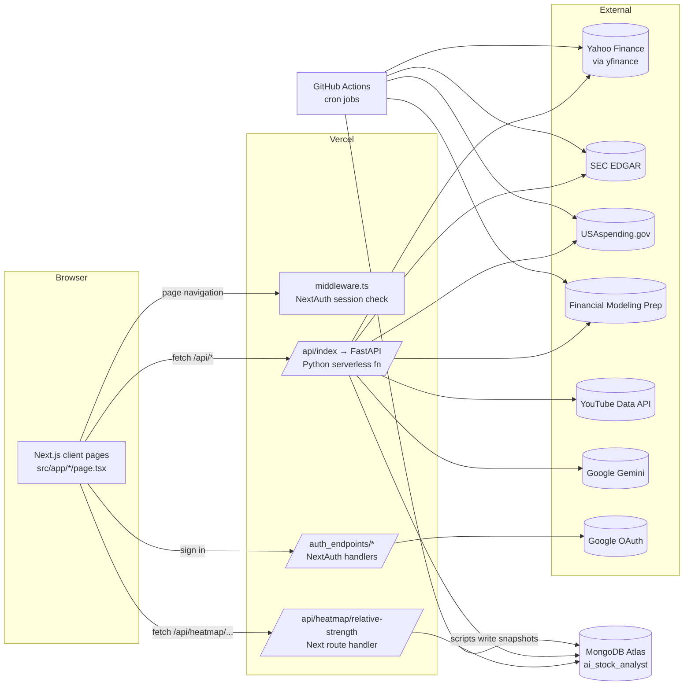
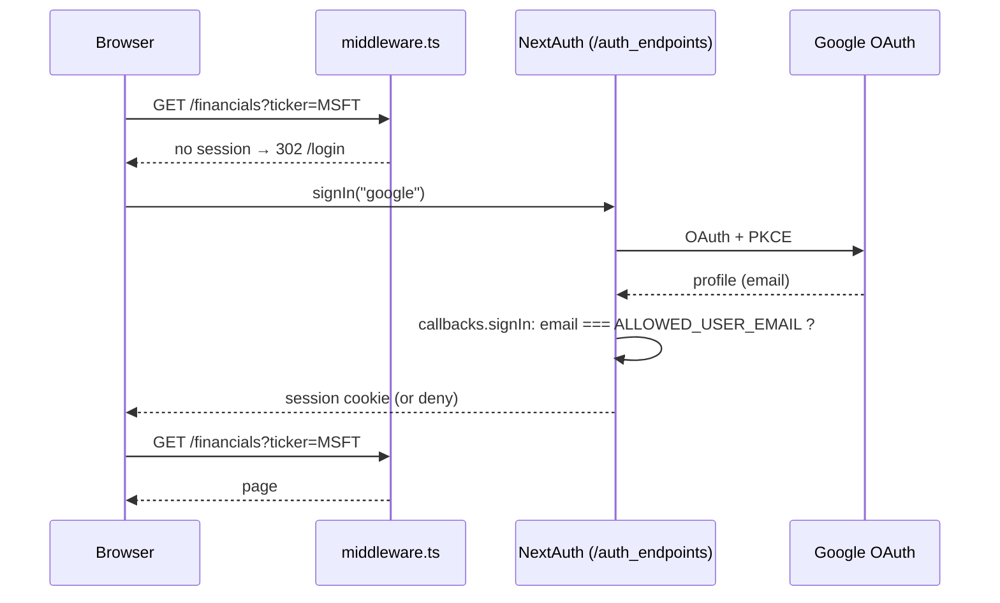
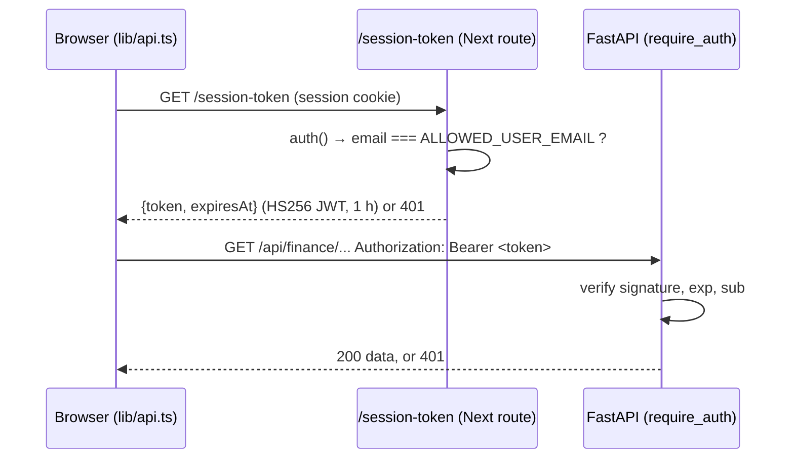
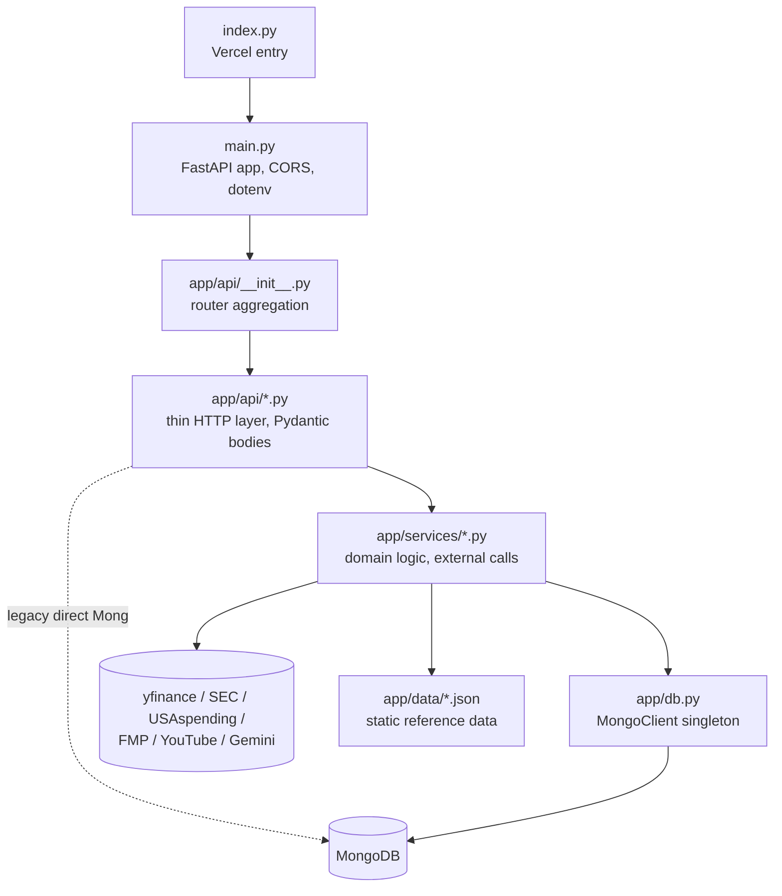

# AI Analyst: Architecture

This document describes how AI Analyst is built: the runtime topology, request and data flows, every module and endpoint, the MongoDB data model, the scheduled jobs, and the known technical debt. It reflects the code on the `ETF` branch as of 2026‑09. For day-to-day coding conventions, see [CLAUDE.md](../CLAUDE.md).

---

## 1. Overview

AI Analyst is a personal equity research dashboard. Enter a ticker and you get company fundamentals, financial statements, price charts, analyst forecasts, ownership, a Monte Carlo DCF valuation, brand sentiment, and LLM-written analyses (filing summaries, valuation, risk, technicals, macro, ETF quality). It also has market-wide views: an S&P 500 relative-strength heatmap, a "Future Leader" leaderboard, government-contractor book-to-bill, congressional trading, and institutional 13F trackers.

Only one person uses it. Google sign-in is restricted to one email address (`ALLOWED_USER_EMAIL`).

| Layer | Technology |
|---|---|
| UI | Next.js 16.1 (App Router), React 19.2, TypeScript 5 (strict), Tailwind CSS v4, shadcn/ui (new-york, Radix), Recharts 3, lucide-react, react-markdown, date-fns |
| Auth | NextAuth (Auth.js) v5 beta, Google provider, JWT session cookie |
| API | Python 3.12, FastAPI, Pydantic, uvicorn (local) |
| Data libs | yfinance, pandas, numpy, BeautifulSoup/lxml, vaderSentiment, httpx/requests |
| LLM | Google Gemini REST API (`gemini-3-flash-preview`, temperature 0.1) |
| Storage | MongoDB Atlas, database `ai_stock_analyst` |
| Hosting | Vercel: Next.js plus a Python serverless function in one project |
| Scheduling | GitHub Actions cron workflows |

---

## 2. Runtime topology



### 2.1 How `/api/*` is routed

The same URL prefix reaches different servers depending on the environment:

| Environment | Where `/api/*` goes | Configured in |
|---|---|---|
| Dev | The browser calls `http://127.0.0.1:8000/api/...` **directly**, because `API_BASE_URL` in `src/lib/api.ts` points there. Relative `/api/*` requests (such as the heatmap route) are served by Next first, and the rest are proxied to `127.0.0.1:8000` | `src/lib/api.ts`, `next.config.ts` (dev-only `rewrites`) |
| Prod | Same-origin `/api/...`. Vercel serves the Next route handler if one matches the path, and otherwise rewrites to the Python function `api/index.py`, which imports `api/main.py:app` | `vercel.json`, `api/index.py` |

FastAPI mounts all routers under `/api` (`main.py: app.include_router(router, prefix="/api")`), so the path the function receives lines up with the routes.

NextAuth is moved to `/auth_endpoints` (`basePath` in `src/auth.ts`) so it doesn't collide with the `/api` proxy.

### 2.2 Authentication



- The middleware matcher is `/((?!api|auth_endpoints|session-token|_next/static|_next/image|favicon.ico).*)`, so the middleware protects **pages** only. The API is protected separately, as §2.3 describes.
- A custom PKCE cookie name is configured to work around Auth.js configuration errors behind Vercel (`AUTH_TRUST_HOST`, `AUTH_URL`).

### 2.3 API authentication

The FastAPI backend can't read the NextAuth session cookie: in dev it runs on a different host (`127.0.0.1:8000`), and the cookie is encrypted in an Auth.js-specific format. So the app uses a short-lived bearer token instead:



- **Signing key:** `HMAC-SHA256(AUTH_SECRET, "ai-analyst-api-token")`, derived the same way in `src/app/session-token/route.ts` and `api/app/auth.py`, so one secret serves both sides without being reused directly.
- **Client (`apiFetch` in `lib/api.ts`):** caches the token *promise*, so parallel requests share one fetch. It refreshes 60 s before expiry and retries once on a 401. If `/session-token` returns 401, it redirects to `/login`.
- **Server (`require_auth`):** attached to every router except `health` in `app/api/__init__.py`. It fails closed with a 500 if `AUTH_SECRET` is missing. If `ALLOWED_USER_EMAIL` is set, the token subject must match it.
- The Next heatmap route calls `auth()` itself and returns 401 without a session.

---

## 3. Frontend (`src/`)

### 3.1 Structure

```
src/
├── auth.ts                         NextAuth config (Google, single allowed email)
├── middleware.ts                   redirect unauthenticated page requests → /login
├── app/
│   ├── layout.tsx                  root html/body, Geist fonts, globals.css
│   ├── globals.css                 Tailwind v4 @theme + shadcn CSS variables (oklch)
│   ├── page.tsx                    "/" Overview dashboard (largest page, ~690 lines)
│   ├── <route>/page.tsx            one folder per feature page (see 3.3)
│   ├── api/heatmap/relative-strength/route.ts   Next route handler → Mongo
│   ├── auth_endpoints/[...nextauth]/route.ts    NextAuth GET/POST
│   ├── login/page.tsx              Google sign-in button
│   └── not-found.tsx
├── components/
│   ├── layout/dashboard-layout.tsx sidebar + header shell used by every page
│   ├── dashboard/*.tsx             feature components (charts, tables, trackers)
│   ├── heatmap/SnpHeatmap.tsx      Recharts Treemap of S&P 500
│   ├── watchlist/watchlist-table.tsx
│   └── ui/*.tsx                    shadcn/ui primitives
└── lib/
    ├── api.ts                      typed-ish fetch wrappers for every FastAPI endpoint
    ├── mongodb.ts                  MongoClient promise (HMR-safe global in dev)
    └── utils.ts                    cn(), formatLargeNumber()
```

### 3.2 Rendering model

Every page is a **client component** (`"use client"`), and data is fetched in the browser after mount. No React Server Component fetches data. The one server-side data path is the heatmap route handler (`revalidate = 3600`).

Each page follows the same shape:

```
export default Page  →  <Suspense fallback={spinner}>
                           <DashboardLayout>
                             <PageContent/>      ← reads ?ticker= via useSearchParams
                           </DashboardLayout>
                         </Suspense>
```

- **The ticker lives in the URL** (`?ticker=`). The header `TickerSearch` does a debounced (300 ms) call to `/api/sec/search` and then `router.push(`${redirectBase}?ticker=X`)`.
- **Sidebar ticker memory:** `DashboardLayout` saves the last *stock* ticker to `localStorage["lastStockTicker"]` and appends it to every nav link. The ETF page is excluded, so browsing ETFs doesn't replace the remembered stock.
- **State:** local `useState`/`useEffect` only. There is no global store, React Query, or SWR. Loading, empty, and data states are rendered by hand. AI results are held in `analysisResult` state and shown with `react-markdown`.

### 3.3 Pages → endpoints → components

| Route | Purpose | `lib/api.ts` calls (→ FastAPI) | Main components |
|---|---|---|---|
| `/` | Overview: profile, key metrics with tooltips, SEC filings with AI summary, news with AI sentiment, AI valuation/risk, peers, Future Leader score, add to watchlist | `fetchCompanyInfo`, `fetchSECFilings`, `fetchCompanyNews`, `fetchFinancials`, `fetchPeerComparison`, `fetchHistoricalMetrics`, `fetchFutureLeaderScore`, `analyzeFiling`, `analyzeNews`, `analyzeValuation`, `analyzeRisk`, `addToWatchlist` | `financial-charts`, `peer-comparison`, `future-leader-score` |
| `/financials` | Quarterly income, balance sheet, cash flow, ratios | `fetchFinancials`, `fetchBalanceSheet`, `fetchCashFlow`, `fetchRatios` | `financial-table`, `financial-charts` |
| `/chart` | Price chart with period/interval, SMA overlays, comparisons, AI technicals | `fetchStockHistory` (+ `analyzeChart`, `fetchQuotes` in children) | `stock-chart`, `chart-analysis`, `sector-list`, `indicator-list` |
| `/simulation` | Monte Carlo DCF (WACC, growth override, bear case) | `runSimulation` | `dcf-histogram` |
| `/forecast` | Analyst targets/recommendations plus recent up/downgrades | `fetchForecast`, `fetchAnalystActions` | (inline) |
| `/ownership` | Insider/institution split, top holders, insider transactions | `fetchOwnership`, `fetchOwnershipDetails` | (inline) |
| `/sentiment` | Brand sentiment (Yahoo news + YouTube, VADER) | `fetchSentiment` | `sentiment-dashboard` |
| `/etf` | ETF overview, holdings, sector weights, chart, AI "Quality Core" analysis | `fetchCompanyInfo`, `fetchCompanyNews`, `fetchStockHistory`, `analyzeNews`; `analyzeEtf` (in `etf-ai-analysis`) | `etf-overview`, `etf-holdings`, `sector-allocation`, `etf-ai-analysis`, `stock-chart` |
| `/watchlist` | Saved tickers with live price/change | `getWatchlist`, `removeFromWatchlist` | `watchlist-table` |
| `/finder` | Sector map or 3×3 style box of curated tickers with quotes | `fetchMarketMap`, `fetchQuotes` | (inline) |
| `/heatmap` | S&P 500 treemap coloured by 1m/3m/6m relative strength | `fetch('/api/heatmap/relative-strength')` (Next route → Mongo) | `heatmap/SnpHeatmap` |
| `/institutional` | Vanguard and Munro Partners 13F top buys/sells (tabs) | `fetchVanguardTrades`, `fetchMunroTrades` | `vanguard-tracker`, `munro-tracker` |
| `/house`, `/senate` | Congressional trades (Mongo snapshots) | `fetchHouseTrades`, `fetchSenateTrades` | `house-tracker`, `senate-tracker` |
| `/congress` | Combined live FMP feed (**not linked in the sidebar**) | `fetchCongressTrades` | `congress-tracker` |
| `/rankings` | Future Leader leaderboard by Small/Mid/Large cap, paginated | `fetchRankings` | (inline) |
| `/govt` | Government-contractor book-to-bill rankings | `fetchGovtRankings` | (inline) |
| `/macro` | Indices, rates, FX, commodities, economic indicators, sector ETFs, AI macro read | `fetchMacroData`, `fetchSectorPerformance`, `analyzeMacroMarket` | `macro-chart-card`, `sector-heatmap` |

`components/dashboard/simulation-chart.tsx` is not imported anywhere. `src/app/munro/` is an empty directory.

### 3.4 Styling

- Tailwind v4 is configured in CSS (`@import "tailwindcss"`, `@theme` in `globals.css`), so there is no `tailwind.config`. The shadcn tokens (`--background`, `--card`, `--primary`, `--chart-1..5`, …) are oklch CSS variables, and a `.dark` variant is declared.
- `components.json` sets up the shadcn CLI: new-york style, neutral base, lucide icons, RSC enabled, and aliases `@/components`, `@/lib`, `@/components/ui`.

---

## 4. Backend (`api/`)

### 4.1 Layering



- **Routers** (`app/api/*.py`) create their service instances **at import time**, as module-level singletons, and mostly just delegate to them.
- **Services** hold the logic. They catch exceptions internally, `print` the error, and return `None`, `[]`, or `{"error": ...}`. They rarely raise.
- **`app/db.py`** provides a lazy `MongoClient` singleton (`db.get_db()` → `ai_stock_analyst`) with a `certifi` CA bundle.
- **`main.py`** loads `api/.env`, sets CORS for `localhost:3000/3001`, and mounts everything at `/api`.

### 4.2 Endpoint catalogue

All paths are prefixed with `/api`.

| Method & path | Handler → service | Source | Notes |
|---|---|---|---|
| `GET /health` | health | — | `{"status":"ok"}` |
| **finance** | `finance.py` → `FinanceService` | | |
| `GET /finance/info/{ticker}` | `get_company_info` | yfinance `.info`, `funds_data` | Stock and ETF fields in one payload (`is_etf`, holdings, sector weights). 404 if none |
| `GET /finance/quotes?symbols=A,B` | `get_quotes` | yfinance | `[]` on failure |
| `GET /finance/history/{ticker}?period&interval` | `get_stock_history` | yfinance | OHLCV list |
| `GET /finance/news/{ticker}` | `get_company_news` | yfinance `.news` | |
| `GET /finance/financials/{ticker}` | `get_quarterly_financials` | yfinance | quarterly income statement |
| `GET /finance/financials/balance-sheet/{ticker}` | `get_quarterly_balance_sheet` | yfinance | |
| `GET /finance/financials/cash-flow/{ticker}` | `get_quarterly_cash_flow` | yfinance | |
| `GET /finance/financials/ratios/{ticker}` | `get_quarterly_ratios` | derived | |
| `GET /finance/historical-metrics/{ticker}` | `get_historical_metrics` | yfinance | |
| `GET /finance/peers/{ticker}` | `get_peer_comparison` | curated `peers_map` + yfinance | |
| `GET /finance/market-map?map_type=sector\|factor` | `get_sector_allocations` / `get_factor_allocations` | hard-coded ticker lists | |
| `GET /finance/macro` | `get_macro_indicators` | yfinance (indices, ^TNX, FX, futures) + `get_economic_data` | **economic data is hard-coded 2024 values** |
| `GET /finance/sectors` | `get_sector_performance` | SPDR sector ETFs (XLK…) | |
| `GET /finance/forecast/{ticker}` | `get_forecast` | yfinance analyst targets | |
| `GET /finance/forecast/actions/{ticker}` | `get_analyst_actions` | yfinance `upgrades_downgrades` | latest 30 |
| `GET /finance/ownership/{ticker}` | `get_ownership` | yfinance `major_holders` | |
| `GET /finance/ownership/details/{ticker}` | `get_ownership_details` | yfinance institutional + insider | |
| `GET /finance/score/{ticker}` | `get_future_leader_score` | yfinance | see §5.2 |
| `GET /finance/rankings?category&page&limit` | `get_rankings` | Mongo `leaderboard` → fallback: live score on a random sample of 20 | paginated `{data,total,page,limit}` |
| `GET /finance/govt/backlog/{ticker}` | `get_govt_backlog` | USAspending + yfinance | live book-to-bill |
| `GET /finance/govt/rankings` | `get_govt_rankings` | Mongo `govt_contracts` | |
| **sec** | `sec.py` → `SECService` | | |
| `GET /sec/filings/{ticker}` | `get_filings` | `data.sec.gov/submissions` | 10‑K/10‑Q/20‑F/6‑K links |
| `GET /sec/search?query=` | `search_tickers` | in-memory list built from `company_tickers.json` plus about 100 hard-coded ETFs | powers header search |
| **ai** | `ai.py` → `AIService` (+ Finance/SEC services) | Gemini | |
| `POST /ai/analyze_filing {ticker,url}` | `summarize_filing` | SEC HTML → first 30k chars | returns `{summary}` |
| `POST /ai/analyze_news {ticker,news[]}` | `analyze_news_sentiment` | client-supplied headlines | `{analysis}` |
| `POST /ai/analyze_chart {ticker,period,interval}` | `analyze_chart_data` | last 60 OHLCV bars | **returns a bare string** |
| `POST /ai/analyze_valuation {ticker}` | `analyze_valuation` | info + quarterly financials | `{analysis}` |
| `POST /ai/analyze_risk {ticker}` | `analyze_risk` | info + financials + ownership | `{analysis}` |
| `POST /ai/analyze_macro_market {macro_data,sector_data}` | `analyze_macro_market` | client-supplied | `{analysis}` |
| `POST /ai/analyze_etf {ticker}` | `analyze_etf_quality` | `FinanceService.get_etf_details` | `{analysis}` |
| **sentiment** | `SentimentService` | | |
| `GET /sentiment/{ticker}` | `get_brand_sentiment` | yfinance news + YouTube search/comments → VADER | NSS, distribution, emotions, keywords, posts |
| **simulation** | `SimulationService` | | |
| `POST /simulation/run {ticker,wacc,growth_rate_mean,simulations,bear_case}` | `run_dcf_simulation` | yfinance annual statements | `lru_cache(32)`; see §5.1 |
| **watchlist** | router talks to Mongo directly | | |
| `GET /watchlist` | — | Mongo `watchlist` + yfinance `fast_info` per ticker | |
| `POST /watchlist {ticker}` | — | yfinance `.info` for name | idempotent |
| `DELETE /watchlist/{ticker}` | — | Mongo | 404 if absent |
| **trackers** | | | |
| `GET /vanguard/trades?limit` | `InstitutionService.get_vanguard_trades` | Mongo `vanguard_tracker` → fallback live 13F diff | |
| `GET /munro/trades?limit` | `InstitutionService.get_munro_trades` | Mongo `munro_tracker` → fallback live | |
| `GET /house/trades` | router → Mongo `house_tracker` | snapshot | `{trades, updated_at}` or `status:no_data` |
| `GET /senate/trades` | router → Mongo `senate_tracker` | snapshot | same |
| `GET /congress/trades?limit` | `CongressService` | live FMP `stable/senate-latest` and `house-latest` | |

### 4.3 Services

| Service | File | Responsibility |
|---|---|---|
| `FinanceService` | `services/finance.py` (~1,700 lines) | Nearly all market data through yfinance: company/ETF info, quotes, history, statements, ratios, forecasts, ownership, macro, sectors, peers, style box, Future Leader score, rankings, USAspending book-to-bill. `_sanitize_data()` recursively converts NaN/Inf to `None` and numpy scalars to Python types. |
| `AIService` | `services/ai.py` | One transport method, `generate_insight(prompt)` (sync `httpx.Client`, 30 s timeout, Gemini `generateContent`), plus one prompt-builder per analysis. On failure it returns error *strings* and never raises. |
| `SECService` | `services/sec.py` | Downloads the SEC `company_tickers.json` **in `__init__`** to build the ticker→CIK map and search cache, adds popular ETFs, lists filings, and fetches and cleans filing text with BeautifulSoup. The User-Agent is hard-coded, as SEC requires. |
| `InstitutionService` | `services/institution_service.py` | 13F tracker for Vanguard (CIK 0000102909) and Munro (CIK 0001768744). It reads Mongo first. Otherwise it fetches the last two 13F‑HR filings, scrapes the index page for the info-table XML, parses holdings, merges on CUSIP, resolves issuer→ticker through the SEC title map, and ranks by value change. |
| `SimulationService` | `services/simulation.py` | Monte Carlo DCF (numpy). |
| `SentimentService` | `services/sentiment_service.py` | Brand-name resolution (manual map, then yfinance name with legal suffixes stripped), Yahoo news, YouTube (top 5 "<brand> Review" videos from the last 30 days plus 5 comments each), VADER scoring, lexicon emotions, keyword counts. |
| `CongressService` | `services/congress_service.py` | Live FMP fetch of both chambers, normalised and sorted by disclosure date. |

---

## 5. Key algorithms

### 5.1 Monte Carlo DCF (`SimulationService.run_dcf_simulation`)

1. Pull up to 5 years of annual revenue and FCF from yfinance. If FCF is missing, compute it as OCF + CapEx. Get net debt from `totalDebt - totalCash`, and price and shares from `fast_info`.
2. Estimate the mean and standard deviation of historical revenue growth and FCF margin. The user's `growth_rate_mean` overrides the growth mean. The base case assumes FCF margins expand toward a target of 18% and a terminal growth rate of 2.5%. `bear_case` changes these assumptions: growth mean −1.5σ, WACC +200 bp, margin −5 pts, target margin 12%, terminal growth 1.5%.
3. Simulate `N` (default 10,000) paths of projected revenue × margin, discount at `wacc` (default 9%), and add a terminal value.
4. Compute equity value = EV − net debt, then per share. Negatives are floored at 0.
5. Output: median (`expected_value`), 25th percentile (`buy_zone_price`), P(value > price) (`win_probability`), P(value < 70% of price) (`max_drawdown_prob`), a 50-bin density histogram, and the assumptions used.

### 5.2 Future Leader score (`FinanceService.get_future_leader_score`, 0–10)

| Factor | Max pts | Pass rule |
|---|---|---|
| Growth efficiency: Rule of 40 (revenue growth % + profit margin %) | 3.0 | >40 full, >20 half |
| Innovation intensity: R&D / revenue | 2.5 | ≥15% |
| Scalability: operating leverage | 2.0 | revenue growth > opex growth |
| Market value: PEG (computed as forward P/E ÷ growth if missing) | 1.5 | low positive PEG (<1.0 full, <1.5 partial) |
| Management: ROIC | 1.0 | >15% |

`/rankings` is served from the `leaderboard` snapshot, which `api/utils/generate_leaderboard.py` builds by scoring every constituent in `app/data/sp_indices.json` (S&P 600 / 400 / 500, scraped from Wikipedia by `utils/fetch_tickers.py`).

### 5.3 Government book-to-bill (`get_govt_backlog`)

Book-to-bill = contract awards over the last 90 days (USAspending `spending_by_award`, award types A–D, searched by UEI or company keyword) ÷ quarterly revenue. `utils/build_uei_mapping.py` maintains `app/data/uei_mapping.json`, and `utils/generate_govt_contracts.py` precomputes the results for known contractors (LMT, RTX, GD, NOC, …) into `govt_contracts`.

### 5.4 Brand sentiment

VADER compound ≥ 0.05 is positive and ≤ −0.05 is negative. **NSS** = (pos − neg) / total × 100. Emotions come from keyword-lexicon hits. Trends are the top 10 non-stopword tokens.

---

## 6. Data model (MongoDB `ai_stock_analyst`)

Most collections hold **precomputed snapshot documents** that batch jobs replace wholesale. They are not incrementally updated entities.

| Collection | Document shape | Writer | Reader |
|---|---|---|---|
| `watchlist` | `{ticker, name}` per ticker | `POST /watchlist` | `GET /watchlist` |
| `leaderboard` | `{_id: "small_cap"\|"mid_cap"\|"large_cap", companies: [{ticker, rank, total_score, factors}], last_updated}` | `utils/generate_leaderboard.py` (every 12 h), `utils/migrate_mongo.py` (one-off) | `FinanceService.get_rankings` |
| `govt_contracts` | `{_id: "contractors", companies: [...]}` | `utils/generate_govt_contracts.py` (daily) | `get_govt_rankings` |
| `vanguard_tracker`, `munro_tracker` | two docs: `{type: "buy"\|"sell", data: [...100], report_date, prev_report_date}` | `scripts/update_vanguard_data.py` (weekly), `scripts/update_munro_data.py` (manual, no workflow) | `InstitutionService._get_from_db` |
| `house_tracker`, `senate_tracker` | `{type: "recent_trades", data: [...], updated_at}`, accumulated, de-duplicated, and sorted on each run | `scripts/update_house_data.py`, `update_senate_data.py` (daily) | `house.py`, `senate.py` routers |
| `snp_heatmap_data` | one doc per S&P 500 ticker: `{ticker, sector, market_cap, relative_strength: {"1m","3m","6m"}, ...}` (bulk upsert) | `scripts/update_snp_heatmap.py` (weekdays 21:30 UTC) | **Next.js** route `/api/heatmap/relative-strength` |

Static reference data in the repo: `api/app/data/sp_indices.json`, `uei_mapping.json`, and `leaderboard.json` (the legacy seed).

---

## 7. Batch jobs and scheduling

| Workflow | Cron (UTC) | Script | Secrets | Python |
|---|---|---|---|---|
| `update_leaderboard.yml` | `0 */12 * * *` | `api/utils/generate_leaderboard.py` | `MONGO_URI` | 3.13 |
| `update_govt_spending.yml` | `0 0 * * *` | `api/utils/generate_govt_contracts.py` | `MONGO_URI` | 3.13 |
| `update_house.yml` | `0 2 * * *` | `api/scripts/update_house_data.py` | `MONGO_URI`, `FMP_API_KEY` | 3.11 |
| `update_senate.yml` | `15 2 * * *` | `api/scripts/update_senate_data.py` | `MONGO_URI`, `FMP_API_KEY` | 3.11 |
| `update_snp_heatmap.yml` | `30 21 * * 1-5` | `api/scripts/update_snp_heatmap.py` | `MONGO_URI` | 3.9 |
| `update_vanguard.yml` | `0 0 * * 0` | `api/scripts/update_vanguard_data.py` | `MONGO_URI` (passed as `MONGODB_URI`) | 3.11 |

All workflows also support `workflow_dispatch`. The scripts add `api/` to `sys.path` so they can reuse `app.services.*`, and they load dotenv optionally so they also run locally.

**Why this pattern exists:** 13F XML parsing, scoring about 1,500 tickers, and paid or rate-limited APIs are far too slow for a Vercel function's time limit. So the function reads a snapshot, and the heavy work runs in Actions.

---

## 8. Configuration and deployment

- **Vercel project:** the Next.js build plus `api/index.py` as a Python function. `api/runtime.txt` is `python-3.12`, and `api/requirements.txt` is kept minimal because of the function size limit (a commit titled "Reduced serverless function size").
- **Environment variables:** see the table in [CLAUDE.md](../CLAUDE.md#environment-variables). The frontend reads `.env.local`, the backend reads `api/.env` (loaded by `main.py`), and CI reads GitHub secrets.
- **Local development:** run `uvicorn main:app --reload --port 8000` from `api/` and `npm run dev` from the root. The Python virtualenv is `.venv/` at the repo root.
- **Branching:** feature branches (`scalping`, `ETF`) are merged by PR into `master`, with Conventional Commit messages.

---

## 9. Known issues and technical debt

Ordered roughly by priority.

| # | Area | Issue | Suggested direction |
|---|---|---|---|
| 1 | **Security** | `api/.env.example` is committed with what look like **real credentials** (Gemini API key, Pinecone key, a Supabase Postgres URL with password). `yf_keys.txt` is also committed. | Rotate those keys now, replace the values with placeholders, and consider purging them from git history. |
| 2 | ~~Security~~ | ✅ **Fixed.** FastAPI endpoints now require a session token (§2.3). | — |
| 3 | ~~Bug~~ | ✅ **Fixed.** `etf-ai-analysis.tsx` now uses `analyzeEtf()` from `lib/api.ts` instead of `localhost:8000`. | — |
| 4 | Performance | Many `async def` handlers (in `finance.py`, `ai.py`, `watchlist.py`, `simulation.py`) call blocking yfinance, httpx, and pymongo, which blocks the event loop. | Change them to `def` so FastAPI runs them in its threadpool. |
| 5 | Performance | `SECService()` downloads `company_tickers.json` in its constructor. It is created in `sec.py`, `ai.py`, and inside each `InstitutionService` (`institution.py`, `munro.py`), so a cold start makes about 4 SEC downloads. | Use a module-level shared instance or `functools.cache`. |
| 6 | Consistency | `house.py`, `senate.py`, and `InstitutionService._get_from_db` create a new `MongoClient` per request (and the first two skip `certifi`). | Use `app.db.db.get_db()`. |
| 7 | API shape | AI responses are inconsistent: `{summary}`, `{analysis}`, and a bare string for `/analyze_chart`. | Standardise on `{analysis}`. |
| 8 | Data quality | `get_economic_data()` returns hard-coded 2024 GDP/CPI/unemployment figures. | Switch to the FRED API. |
| 9 | Routing | The Next route `/api/heatmap/...` shares the `/api` namespace with the FastAPI proxy and depends on filesystem-first precedence. | Move it to FastAPI, or to a non-`/api` path. |
| 10 | Frontend | 84 `no-explicit-any` and 72 unused-variable lint errors. API responses are untyped. `app/page.tsx` is about 690 lines. | Add response interfaces in `lib/types.ts`, and split the overview into components. |
| 11 | Hygiene | Scratch files are committed: `api/debug_*.py`, `api/verify_*.py`, `api/test_*.py`, root `debug_score.py`, `reproduce_history_error.py`, `services/finance.py_temp_snippet`. There is also an unused `simulation-chart.tsx`, an empty `app/munro/`, and an unlinked `/congress` page. | Delete them or move them to `api/tools/`. |
| 12 | CI | Workflow Python versions vary (3.9, 3.11, 3.13), while the runtime is 3.12. Some workflows install ad-hoc dependency lists instead of `requirements.txt`. `update_munro_data.py` has no workflow. | Standardise on 3.12 plus `requirements.txt`, and add a Munro workflow. |
| 13 | Ops | NextAuth has `debug: true`. Logging uses `print`. Gemini is called with the API key in the query string. The model name is hard-coded. | Make debug depend on the environment, use `logging`, send the key in the `x-goog-api-key` header, and move the model to an env var. |
| 14 | Testing | There are no automated tests on either side. | Start with pytest for the pure functions (`_sanitize_data`, scoring, DCF with mocked yfinance) and FastAPI `TestClient` smoke tests. |
